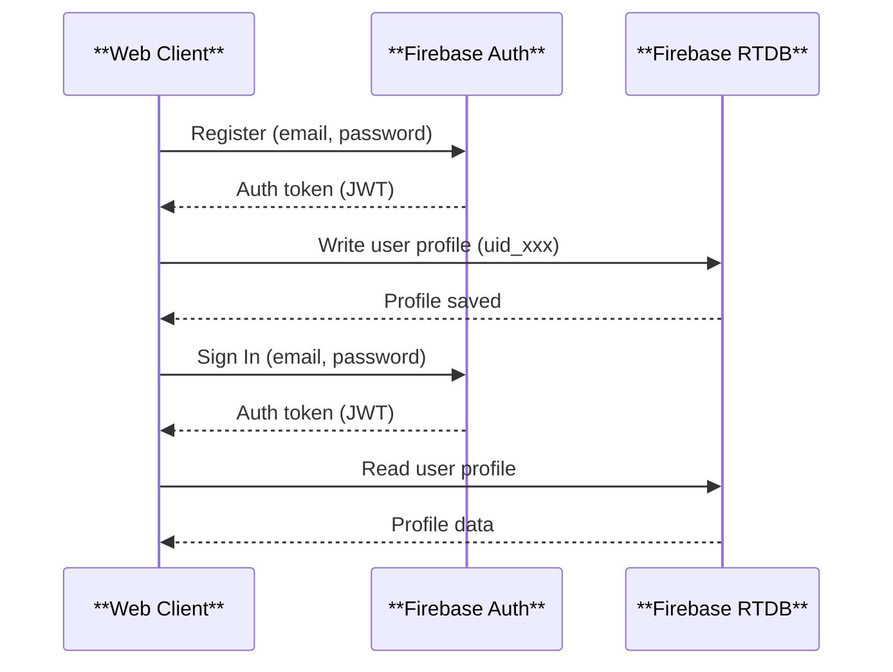
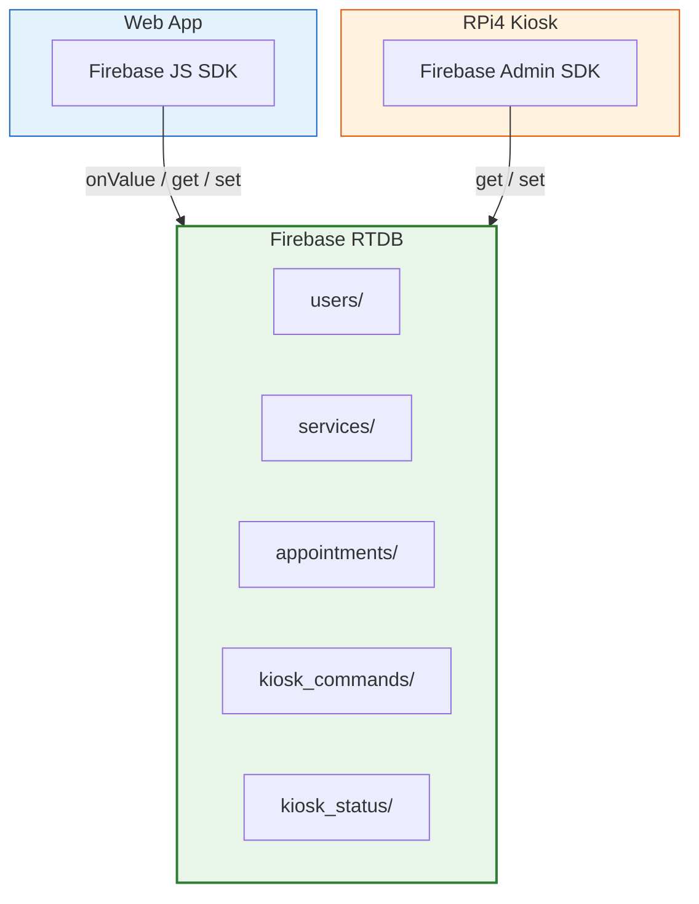
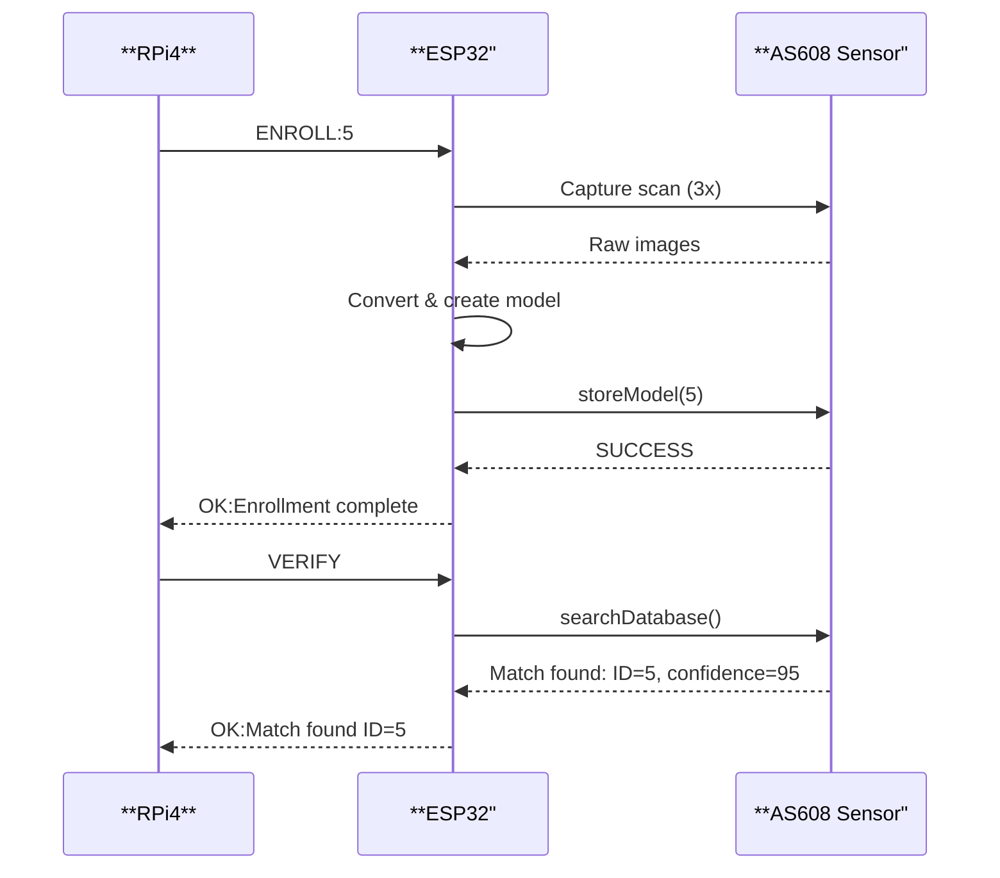

# API Specification

## Overview

This system uses **Firebase** as the primary backend-as-a-service. There is no custom REST API backend. All data operations are performed directly by clients using the **Firebase SDK** (Web SDK for the browser, Admin SDK for the RPi4 kiosk).

For the **RPi4 to ESP32 serial protocol**, see [src/esp/uart_protocol.md](../../src/esp/uart_protocol.md).

---

## 1. Firebase Authentication API

### Authentication Flow



### Sign Up
Creates a new user account.

```javascript
import { createUserWithEmailAndPassword } from "firebase/auth";

await createUserWithEmailAndPassword(auth, email, password);
```

| Parameter | Type | Description |
|-----------|------|-------------|
| `email` | string | Valid email address |
| `password` | string | Min 6 characters |

**User Profile (written to RTDB):**
```json
{
  "users/{uid}": {
    "first_name": "Juan",
    "last_name": "Dela Cruz",
    "email": "juan@example.com",
    "phone": "09171234567",
    "birth_date": "1990-01-15",
    "address": "123 Street, Barangay Dolores, Taytay, Rizal",
    "role": "resident",
    "status": "pending",
    "fingerprint_enrolled": false,
    "fingerprint_template_id": null,
    "created_at": "2026-06-25T08:00:00Z"
  }
}
```

### Sign In
Authenticates a user and returns a session token.

```javascript
import { signInWithEmailAndPassword } from "firebase/auth";

const userCredential = await signInWithEmailAndPassword(auth, email, password);
```

### Sign Out
```javascript
import { signOut } from "firebase/auth";

await signOut(auth);
```

### Password Reset
```javascript
import { sendPasswordResetEmail } from "firebase/auth";

await sendPasswordResetEmail(auth, email);
```

---

## 2. Firebase Realtime Database (RTDB) API

### Data Operations Flow



### Users

#### Read User Profile
```javascript
import { get, ref } from "firebase/database";

const snapshot = await get(ref(db, `users/${uid}`));
const userData = snapshot.val();
```

#### Update User Profile
```javascript
import { update, ref } from "firebase/database";

await update(ref(db, `users/${uid}`), {
  first_name: "Updated Name",
  phone: "09187654321"
});
```

### Services

#### List All Services
```javascript
const snapshot = await get(ref(db, "services"));
const services = snapshot.val();
```

### Appointments

#### Book an Appointment
```javascript
import { push, set, ref, runTransaction } from "firebase/database";

// Atomically lock the slot
const slotKey = `${serviceId}_${date}_${time}`;
const slotRef = ref(db, `appointments/slot_bookings/${slotKey}`);

await runTransaction(slotRef, (current) => {
  if (current) return;
  return { resident_id: uid, booked_at: new Date().toISOString() };
});

// Create the appointment
const newAppointmentRef = push(ref(db, "appointments"));
await set(newAppointmentRef, {
  resident_id: uid,
  service_id: serviceId,
  service_name: serviceName,
  appointment_date: "2026-06-25",
  start_time: "09:00",
  end_time: "09:30",
  status: "scheduled",
  queue_number: 15
});
```

### Kiosk Commands

#### Create Command (Web Admin -> RPi4)
```javascript
import { push, set, ref } from "firebase/database";

const commandRef = push(ref(db, "kiosk_commands"));
await set(commandRef, {
  type: "enroll",
  target_uid: userId,
  template_id: 5,
  status: "pending",
  created_at: new Date().toISOString()
});
```

#### Poll Commands (RPi4)
```python
from firebase_admin import db

commands = db.reference('kiosk_commands').get()
for cmd_id, cmd in commands.items():
    if cmd.get('status') == 'pending':
        # Process command
        pass
```

---

## 3. Serial Communication Protocol (RPi4 to ESP32)

### Command Flow



### Commands (RPi4 -> ESP32)

| Command | Format | Description |
|---------|--------|-------------|
| Enroll | `ENROLL:<id>` | Enroll fingerprint to template ID (0-161) |
| Verify | `VERIFY` | Verify any finger (1:N match) |
| Delete | `DELETE:<id>` | Delete specific template |
| List | `LIST` | List all stored template IDs |
| Count | `COUNT` | Get total template count |
| Status | `STATUS` | Get ESP32 status |

### Responses (ESP32 -> RPi4)

| Status | Format |
|--------|--------|
| OK | `OK:<message>` |
| Error | `ERR:<error_code>:<message>` |
| Data | `DATA:<key>=<value>` |

### Serial Command/Response Examples

```
# Enroll request
-> ENROLL:5
<- OK:Enrollment started
<- OK:Enrollment complete

# Verify request
-> VERIFY
<- OK:Match found ID=5

# Delete request
-> DELETE:5
<- OK:Template 5 deleted

# Count request
-> COUNT
<- DATA:count=45
```
