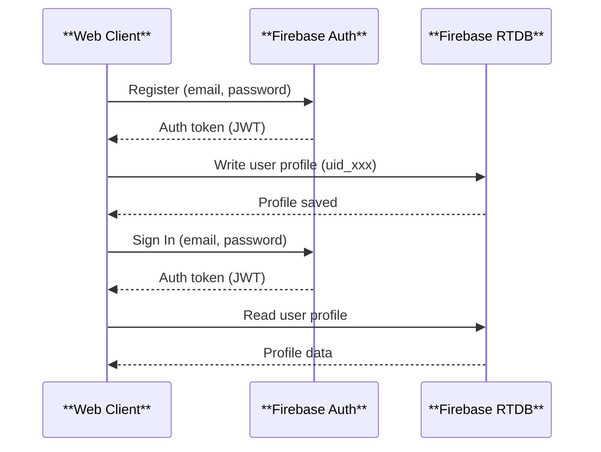
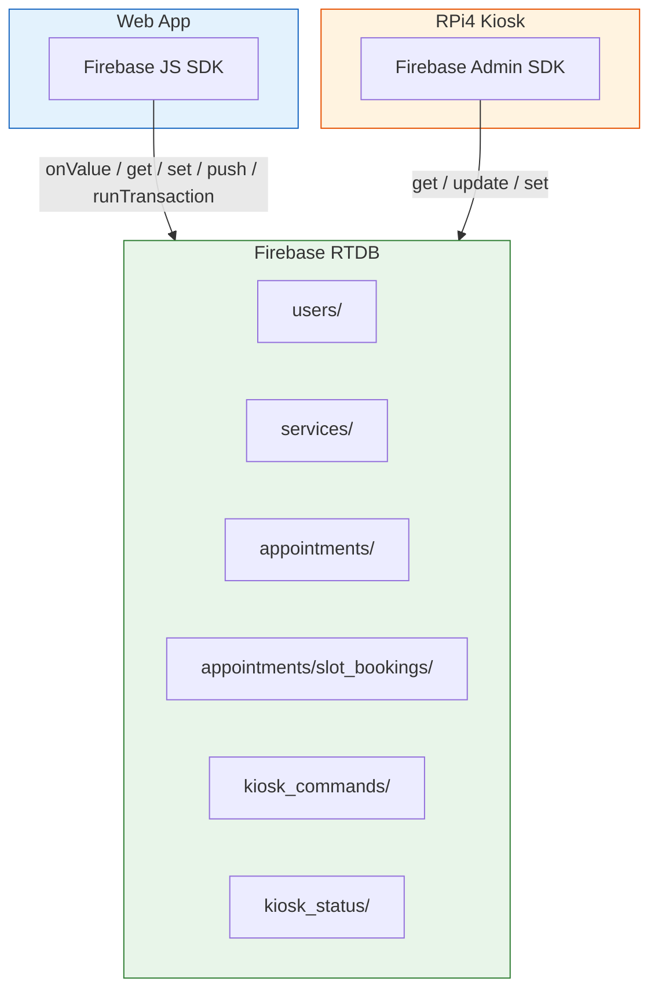
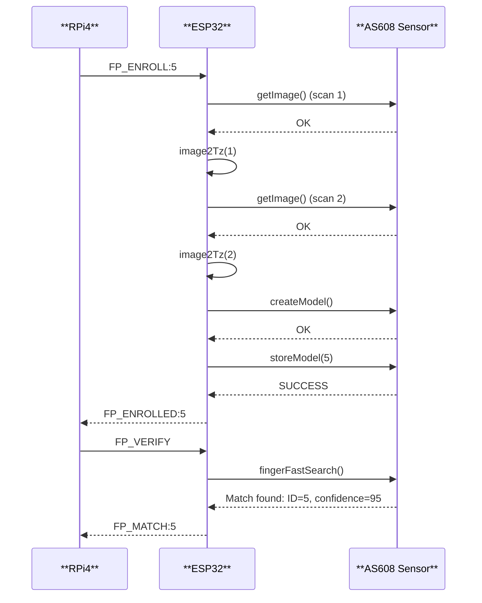

# API Specification (Updated — Actual Codebase)

## Overview

This system uses **Firebase** as the primary backend-as-a-service. There is no custom REST API backend. All data operations are performed directly by clients using the **Firebase SDK** (Web SDK for the browser, Admin SDK for the RPi4 kiosk). SMS operations are handled via **Vercel Serverless functions** that call **Semaphore.co** for Philippine SMS delivery.

For the **RPi4 to ESP32 serial protocol**, see [src/esp/uart_protocol.md](../../src/esp/uart_protocol.md).

---

## 1. Firebase Authentication API

### Authentication Flow



### Sign Up
Creates a new user account. **OTP phone verification is required before account creation.**

```javascript
import { createUserWithEmailAndPassword } from "firebase/auth";

await createUserWithEmailAndPassword(auth, email, password);
```

| Parameter | Type | Description |
|-----------|------|-------------|
| `email` | string | Valid email address |
| `password` | string | Min 6 characters |

**User Profile (written to RTDB after OTP verification):**

```json
{
  "users/{uid}": {
    "first_name": "Juan",
    "last_name": "Dela Cruz",
    "middle_name": "Lopez",
    "email": "juan@example.com",
    "phone": "09171234567",
    "birth_date": "1990-01-15",
    "address": "123 Street, Barangay Dolores, Taytay, Rizal",
    "role": "resident",
    "status": "pending",
    "fingerprint_enrolled": false,
    "created_at": "2026-06-25T08:00:00Z"
  }
}
```

### Sign In
Authenticates a user and returns a session token.

```javascript
import { signInWithEmailAndPassword } from "firebase/auth";

const userCredential = await signInWithEmailAndPassword(auth, email, password);
```

### Sign Out
```javascript
import { signOut } from "firebase/auth";

await signOut(auth);
```

---

## 2. Firebase Realtime Database (RTDB) API

### Data Operations Flow



### Users

#### Read User Profile
```javascript
import { get, ref } from "firebase/database";

const snapshot = await get(ref(db, `users/${uid}`));
const userData = snapshot.val();
```

#### Update User Profile
```javascript
import { update, ref } from "firebase/database";

await update(ref(db, `users/${uid}`), {
  first_name: "Updated Name",
  phone: "09187654321"
});
```

### Services

#### List Active Services
```javascript
// Real-time subscription
import { onValue, ref } from "firebase/database";

const unsub = onValue(ref(db, 'services'), (snapshot) => {
  const data = snapshot.val();
  // Filter by is_active
});
```

### Appointments

#### Book an Appointment (with Atomic Slot Lock + OTP)

```javascript
import { push, set, ref, runTransaction, get } from "firebase/database";

// 1. Generate slot key
const slotKey = sanitizeKey(`${serviceId}_${date}_${startTime}_${endTime}`);
const slotRef = ref(db, `appointments/slot_bookings/${slotKey}`);

// 2. Atomically lock the slot with claim token
const claimToken = `claim_${Date.now()}_${Math.random()}`;
await runTransaction(slotRef, (current) => {
  if (current !== null) return current; // Already claimed
  return claimToken;
});

// 3. Verify we own the claim
const claimSnap = await get(slotRef);
if (claimSnap.val() !== claimToken) {
  throw new Error('Slot already taken');
}

// 4. Check daily capacity
const allSnap = await get(ref(db, 'appointments'));
// ... count same-day non-cancelled appointments ...

// 5. Generate enrollment OTP
const otp = Math.floor(100000 + Math.random() * 900000).toString();

// 6. Create appointment with OTP
const newRef = push(ref(db, 'appointments'));
await set(newRef, {
  resident_id: uid,
  service_id: serviceId,
  service_name: serviceName,
  appointment_date: "2026-06-25",
  start_time: "09:00",
  end_time: "09:30",
  status: "scheduled",
  queue_number: 15,
  enrollment_otp: otp,
  enrollment_otp_expires_at: new Date(Date.now() + 24*60*60*1000).toISOString(),
  created_at: new Date().toISOString()
});
```

#### Cancel Appointment
```javascript
import { update, set, ref, get } from "firebase/database";

// Read appointment to get slot info
const snap = await get(ref(db, `appointments/${appointmentId}`));
const apt = snap.val();

// Cancel
await update(ref(db, `appointments/${appointmentId}`), { status: 'cancelled' });

// Release slot
const slotKey = `${apt.service_id}_${apt.appointment_date}_${apt.start_time}_${apt.end_time}`;
await set(ref(db, `appointments/slot_bookings/${slotKey}`), null);
```

#### Regenerate Enrollment OTP
```javascript
import { update, ref, get } from "firebase/database";

// Guard: refuse if fingerprint already enrolled
const aptSnap = await get(ref(db, `appointments/${appointmentId}`));
const apt = aptSnap.val();
const userSnap = await get(ref(db, `users/${apt.resident_id}`));
if (userSnap.val().fingerprint_enrolled) {
  throw new Error('Fingerprint already enrolled.');
}

// Generate new OTP
const otp = Math.floor(100000 + Math.random() * 900000).toString();
await update(ref(db, `appointments/${appointmentId}`), {
  enrollment_otp: otp,
  enrollment_otp_expires_at: new Date(Date.now() + 24*60*60*1000).toISOString(),
  enrollment_otp_consumed_at: null,
});
```

### Kiosk Commands

#### Create Command (Web Admin → RPi4)
```javascript
import { push, ref } from "firebase/database";

await push(ref(db, 'kiosk_commands'), {
  type: "enroll",   // verify | enroll | auto_enroll | search | delete | list | clear | count | ping
  target_uid: "uid_xxx",
  slot: 5,
  status: "pending",
  created_at: new Date().toISOString()
});
```

#### Poll Commands (RPi4)
```python
from firebase_admin import db

commands = db.reference('kiosk_commands').get() or {}
for cmd_id, cmd in commands.items():
    if cmd.get('status') == 'pending' and cmd_id not in processed_ids:
        result = processor.process(cmd)
        db.reference(f'kiosk_commands/{cmd_id}').update({
            'status': result.get('status', 'completed'),
            'result': result,
            'completed_at': int(time.time() * 1000),
        })
        processed_ids.add(cmd_id)
```

---

## 3. Serial Communication Protocol (RPi4 ↔ ESP32)

### Command Flow (Actual Commands)



### Commands (RPi4 → ESP32)

| Command | Format | Description | Response |
|---------|--------|-------------|----------|
| Ping | `PING` | Check if alive | `PONG` |
| Enroll at ID | `FP_ENROLL:<id>` | Enroll fingerprint to specific ID (1-127) | Step-by-step OK + `FP_ENROLLED:<id>` or `ERR:` |
| Auto-Enroll | `FP_AUTOENROLL` | Enroll to next available ID | `FP_ENROLLED:<id>` or `ERR:` |
| Verify | `FP_VERIFY` | Scan and match (waits for finger) | `FP_MATCH:<id>` or `FP_NO_MATCH` or `ERR:` |
| Search | `FP_SEARCH` | Search for fingerprint (one-shot) | `FP_MATCH:<id>` or `FP_NO_MATCH` or `ERR:` |
| Delete | `FP_DELETE:<id>` | Delete template | `OK` or `ERR:` |
| Count | `FP_COUNT` | Get template count | `OK:<count>` |
| Last ID | `FP_ID` | Get last matched ID | `OK:<id>` or `ERR:No match` |
| List | `FP_LIST` | List all enrolled template IDs | `OK:<count>` + `ID:<id>` lines |
| Clear | `FP_CLEAR` | Delete all templates | `OK` or `ERR:` |
| Monitor | `FP_MONITOR` | Toggle continuous monitoring | `OK:Monitor ON/OFF` |

### Responses (ESP32 → RPi4)

| Response | Format | Notes |
|----------|--------|-------|
| OK | `OK:<message>` | Success |
| Error | `ERR:<message>` | Failure |
| Match Found | `FP_MATCH:<id>` | Template matched |
| No Match | `FP_NO_MATCH` | Finger detected but no match |
| Enrolled | `FP_ENROLLED:<id>` | Enrollment complete |
| Debug | `[DEBUG] <message>` | Informational — skipped by RPi4 parser |

### Serial Command/Response Examples

```
# Enroll request
-> FP_ENROLL:5
<- OK:Place finger on sensor
<- OK:Hold still...
<- FP_ENROLLED:5

# Verify request
-> FP_VERIFY
<- OK:Place finger on sensor for verification
<- FP_MATCH:5

# Delete request
-> FP_DELETE:5
<- OK

# Count request
-> FP_COUNT
<- OK:12

# List request
-> FP_LIST
<- OK:4
<- ID:1
<- ID:5
<- ID:12
<- ID:42

# Monitor mode
-> FP_MONITOR
<- OK:Monitor ON
    (ESP32 polls every 500ms)
    (when finger detected and matched → FP_MATCH:5)
    (when finger detected no match → FP_NO_MATCH)
```

---

## 4. SMS API Routes

The system exposes 5 Node.js Serverless endpoints under `/api/sms/`. All use `runtime = 'nodejs'` and `dynamic = 'force-dynamic'`.

### 4.1 POST /api/sms/send-otp

Generates a 6-digit OTP, creates a stateless HMAC-signed session token, and sends the OTP via Semaphore SMS.

**Request:**
```json
{
  "phone": "09634905586"
}
```

**Response (200):**
```json
{
  "success": true,
  "sessionId": "eyJwaG9uZSI6IjA5NjM0OTA1NTg2Iiwib3RwIjoiNzI5MzgzIiwiZXhwaXJlc0F0IjoxNzUwNTYwMDAwMDAwLCJhdHRlbXB0cyI6MH0=.abc123def456signature"
}
```

**Response (400):**
```json
{
  "success": false,
  "error": "Phone number format not recognized. Use 09XXXXXXXXX, +639XXXXXXXXX, or 639XXXXXXXXX."
}
```

### 4.2 POST /api/sms/verify-otp

Verifies an OTP against the HMAC-signed session token. **No server-side storage** — the session token contains all verification data.

**Request:**
```json
{
  "sessionId": "eyJ...",
  "otp": "729383"
}
```

**Response (200):**
```json
{
  "success": true,
  "message": "OTP verified successfully."
}
```

**Response (400):**
```json
{
  "success": false,
  "error": "Invalid OTP. 2 attempts remaining."
}
```

### 4.3 POST /api/sms/booking-confirmation

Sends a booking confirmation SMS with service details, queue number, and enrollment code.

**Request:**
```json
{
  "phone": "09634905586",
  "serviceName": "Barangay Clearance",
  "appointmentDate": "2026-06-28",
  "startTime": "09:00",
  "endTime": "09:30",
  "enrollmentCode": "729383",
  "queueNumber": 15
}
```

**Response (200):**
```json
{
  "success": true,
  "data": {
    "messageId": "123456789",
    "recipient": "09634905586",
    "status": "Sent"
  }
}
```

**SMS Content:**
```
Barangay Dolores Appointment Confirmed!
Service: Barangay Clearance
Date: 2026-06-28
Time: 9:00 AM - 9:30 AM
Queue #: 15
Enrollment Code: 729383

Present your enrollment code at the kiosk to enroll your fingerprint.
```

### 4.4 POST /api/sms/reminder

Sends an appointment reminder SMS (30 minutes before scheduled time).

**Request:**
```json
{
  "phone": "09634905586",
  "serviceName": "Barangay Clearance",
  "appointmentDate": "2026-06-28",
  "startTime": "09:00",
  "endTime": "09:30"
}
```

**Response (200):**
```json
{
  "success": true,
  "message": "Reminder sent."
}
```

**SMS Content:**
```
Reminder: Your appointment at Barangay Dolores is in 30 minutes!
Service: Barangay Clearance
Date: 2026-06-28
Time: 9:00 AM - 9:30 AM
Check-in at the kiosk 1 minute before or during your scheduled time.
```

### 4.5 POST /api/sms/send

Sends an arbitrary SMS message (admin manual trigger).

**Request:**
```json
{
  "phone": "09634905586",
  "message": "Your manual message here"
}
```

**Response (200):**
```json
{
  "success": true,
  "data": {
    "messageId": "123456789",
    "recipient": "09634905586",
    "status": "Sent"
  }
}
```

### SMS Architecture: Stateless HMAC OTP

```
┌──────────────────┐      ┌──────────────────────────────┐      ┌──────────────────┐
│                  │      │  HMAC-SHA256 Signed Token      │      │                  │
│  generateOtp()   │─────►│  createOtpSession(phone, otp) │─────►│   sessionId      │
│  (Math.random)   │      │                               │      │  base64(payload) │
│                  │      │  payload = { phone, otp,       │      │        .         │
│                  │      │    expiresAt (5min),           │      │  hmac(payload)   │
│                  │      │    attempts: 0 }               │      └──────────────────┘
│                  │      │  sig = HMAC-SHA256(encoded)    │
└──────────────────┘      │  key = SEMAPHORE_API_KEY      │
                          └──────────────────────────────┘
                                      │
                                      ▼
┌──────────────────┐      ┌──────────────────────────────┐      ┌──────────────────┐
│  verifyOtp()     │◄─────│  Parse sessionId              │◄─────│  User submits    │
│  1. Verify HMAC  │      │  Recompute HMAC, compare      │      │  { sessionId,    │
│  2. Check expiry │      │  Decode payload               │      │    otp }         │
│  3. Check count  │      │  Validate OTP value           │      └──────────────────┘
│  4. No DB reads  │      │  Increment attempts           │
└──────────────────┘      └──────────────────────────────┘
```

**Key Properties:**
- No server-side storage (survives cold starts on any Vercel instance)
- HMAC key is `SEMAPHORE_API_KEY` (existing secret, no new env vars needed)
- 5-minute TTL, 3-attempt limit (embedded in the token)
- Pure Node.js crypto — no external dependencies

---

## 5. Kiosk Heartbeat & Status

The RPi4 writes to `kiosk_status/default` every 30 seconds via the heartbeat background thread.

**Payload:**
```json
{
  "online": true,
  "last_heartbeat": 1782133302442,
  "esp32_connected": true,
  "template_count": 42,
  "updated_at": "2026-06-27T21:00:00.000000Z"
}
```

---

## 6. RTDB Schema Summary

```
/ (root)
├── users/{uid}
│   ├── first_name, last_name, middle_name?, email, phone
│   ├── birth_date, address
│   ├── role: "resident" | "admin"
│   ├── status: "pending" | "active"
│   ├── fingerprint_enrolled: boolean
│   ├── fingerprint_template_id: number?
│   └── created_at: ISO string
│
├── services/{service_id}
│   ├── name, description?, department?, duration_minutes
│   ├── slot_capacity_per_day, is_active
│   └── created_at: ISO string
│
├── appointments/{appointment_id}
│   ├── resident_id, service_id, service_name
│   ├── appointment_date, start_time, end_time
│   ├── status: "scheduled" | "checked_in" | "completed" | "cancelled"
│   ├── queue_number, verified_by_fingerprint
│   ├── enrollment_otp: string? (6-digit)
│   ├── enrollment_otp_expires_at: string? (ISO, 24h expiry)
│   ├── enrollment_otp_consumed_at: string? (ISO)
│   ├── sms_reminder_sent: boolean?
│   ├── sms_reminder_sent_at: string? (ISO)
│   ├── cancelled_at: string? (ISO)
│   ├── cancel_reason: string?
│   └── created_at: ISO string
│
├── appointments/slot_bookings/{slot_key}
│   ├── Composite key: {service_id}_{date}_{start_time}_{end_time}
│   └── Value: claim_token | appointment_id
│
├── kiosk_commands/{command_id}
│   ├── type: "verify" | "enroll" | "auto_enroll" | "search" | "delete" | "list" | "clear" | "monitor" | "count" | "ping"
│   ├── target_uid?, template_id?, slot?
│   ├── status: "pending" | "processing" | "completed" | "failed"
│   ├── result: { ... }
│   ├── created_by?, created_at, completed_at?
│   └── Note: Polled by RPi4 every 5s; processed_ids set prevents double-processing
│
└── kiosk_status/{kiosk_id}
    ├── online: boolean
    ├── last_heartbeat: epoch ms
    ├── esp32_connected: boolean
    ├── template_count: number
    ├── firmware_version?, uptime_seconds?, updated_at
    └── Note: Written by RPi4 heartbeat thread every 30s
```
