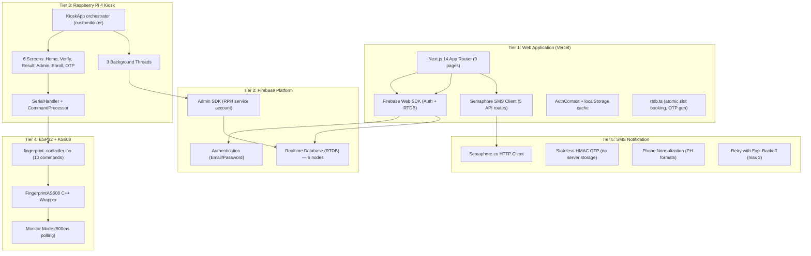
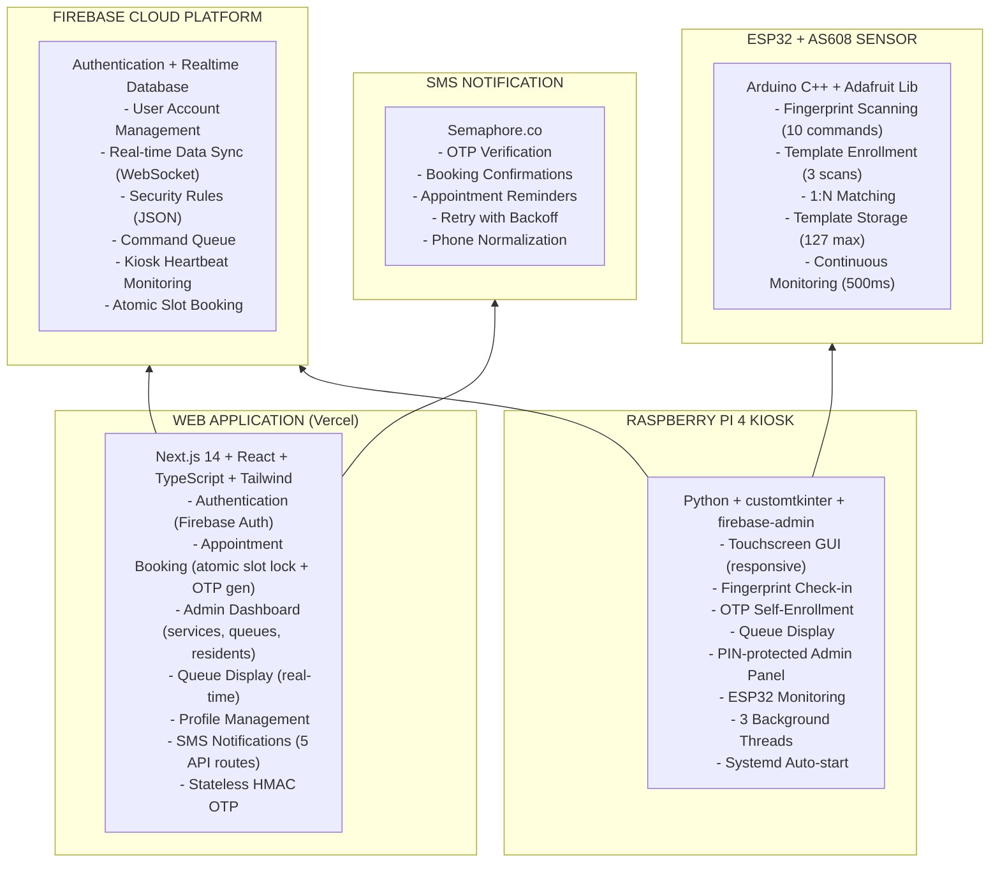

# Component Details (Updated — Actual Codebase)

## System Component Overview

The Smart Appointment Scheduling Kiosk consists of **five** tiers: Web Application, Firebase Cloud Services, Raspberry Pi 4 Kiosk, ESP32 + AS608, and SMS Notification. This document reflects the **actual built system** at `git HEAD`.

---

## System Architecture (Component View)

---

## Tier 1: Web Application (`src/web/`)

### 1.1 Next.js Application

| Property | Details |
|----------|---------|
| **Technology** | Next.js 14 (App Router) |
| **Language** | TypeScript 5.5 |
| **Deployment** | Vercel (static pages + Serverless functions) |
| **Styling** | Tailwind CSS 3.4 |
| **Entry Point** | `src/web/src/app/layout.tsx` |

**Pages (9 total):**

| Page | Route | Purpose |
|------|-------|---------|
| `page.tsx` | `/` | Landing page, feature cards, auth-aware nav |
| `login/page.tsx` | `/login` | Firebase Auth sign-in |
| `register/page.tsx` | `/register` | Registration with OTP phone verification |
| `booking/page.tsx` | `/booking` | Multi-step booking (service → date → time → confirm) with atomic slot lock |
| `my-appointments/page.tsx` | `/my-appointments` | Appointment list, cancel, OTP display/regenerate |
| `profile/page.tsx` | `/profile` | Edit profile, view appointments, fingerprint status |
| `kiosk/page.tsx` | `/kiosk` | Public real-time queue display (read-only) |
| `dolores-taytay-admin/page.tsx` | `/dolores-taytay-admin` | Admin dashboard (services, queues, residents, stats) |
| `settings/page.tsx` | `/settings` | Kiosk management, notifications, security, app prefs |

### 1.2 Library Modules

| Component | File | Purpose |
|-----------|------|---------|
| **Firebase Init** | `firebase.ts` | Initialize Firebase app with env vars, guarded for SSR |
| **Auth Functions** | `auth.ts` | signUp, signIn, signOut, getUserData |
| **Auth Context** | `AuthContext.tsx` | React context + localStorage cache (`barangay_session_v1`) |
| **RTDB Operations** | `rtdb.ts` | CRUD + real-time subscriptions, atomic slot booking via `runTransaction`, OTP generation/regeneration |
| **SMS Client** | `sms.ts` | Browser-side wrappers for all 5 `/api/sms/*` endpoints |
| **Auth Guard** | `useAuthGuard.ts` | Route protection hook (public/private routing) |
| **Utilities** | `utils.ts` | `to12HourFormat()` |

### 1.3 Semaphore SMS Module (`src/web/src/lib/semaphore/`)

| File | Purpose |
|------|---------|
| `client.ts` | Full HTTP client: retry with exponential backoff + jitter, structured logging with `__semaphoreLogHooks`, phone redaction, timeout, abort support |
| `config.ts` | Config from env vars (`SEMAPHORE_API_KEY`, `SEMAPHORE_SENDER_NAME`, `SEMAPHORE_TIMEOUT_MS`, `SEMAPHORE_MAX_RETRIES`) |
| `phone.ts` | Philippine phone normalization (09xx, +639xx, 639xx, 9xx), message validation (max 800 chars), phone redaction for logs |
| `types.ts` | `SemaphoreMessageResult`, `SemaphoreError` (with code, httpStatus, providerStatus, retryable), `SendSmsOptions` |
| `route-helpers.ts` | `jsonError()`, `jsonOk()`, `handleSemaphoreError()`, `readJsonBody()` |
| `index.ts` | Re-exports |

### 1.4 API Routes (`src/web/src/app/api/sms/`)

| Route | Method | Purpose | Key Detail |
|-------|--------|---------|------------|
| `/api/sms/send-otp` | POST | Generate OTP, create HMAC-signed session, send via Semaphore | `import 'server-only'` |
| `/api/sms/verify-otp` | POST | Verify HMAC-signed OTP token (stateless) | No DB reads |
| `/api/sms/booking-confirmation` | POST | Send booking confirmation SMS with service name, date, time, queue number, enrollment code | Fire-and-forget from booking page |
| `/api/sms/reminder` | POST | Send appointment reminder SMS | 30-min reminder message |
| `/api/sms/send` | POST | Send arbitrary SMS | Admin manual trigger |

### 1.5 OTP Store (`api/sms/otp-store.ts`)

**Stateless HMAC-SHA256 tokens. No server-side storage.**

- `createOtpSession(phone, otp)` → `base64(payload).hmac_signature`
- `verifyOtp(token, code)` → validates HMAC, expiry (5 min), attempts (max 3)
- HMAC key: `SEMAPHORE_API_KEY` env var
- Survives cold starts on any Vercel instance

### 1.6 Type Definitions (`src/web/src/types/index.ts`)

| Type | Key Fields |
|------|-----------|
| `User` | uid, first_name, last_name, middle_name?, email?, phone, birth_date, address, role, status, fingerprint_enrolled, fingerprint_template_id?, created_at |
| `Service` | id, name, description?, duration_minutes, slot_capacity_per_day, department?, is_active, created_at |
| `Appointment` | id, resident_id, service_id, service_name, appointment_date, start_time, end_time, status, queue_number, verified_by_fingerprint, enrollment_otp?, enrollment_otp_expires_at?, enrollment_otp_consumed_at?, sms_reminder_sent?, cancelled_at? |
| `KioskCommand` | id?, type (`verify|enroll|delete`), target_uid?, slot?, status, result?, created_at, completed_at? |
| `KioskStatus` | online, last_heartbeat, esp32_connected, template_count, current_action |
| `StatsResponse` | total_residents, today_appointments, checked_in_today, pending_activation, active_services |

### 1.7 UI Components

| Component | Purpose |
|-----------|---------|
| `Providers.tsx` | AuthProvider wrapper |
| `MobileBackButton.tsx` | Mobile-responsive back navigation |

---

## Tier 2: Firebase Cloud Services

| Service | Purpose | Access |
|---------|---------|--------|
| **Authentication** | Email/password user auth | Web SDK (client) + Admin SDK (server) |
| **Realtime Database** | JSON NoSQL data store with real-time sync | Web SDK + Admin SDK |

**RTDB Nodes (6):**
- `users/{uid}` — Resident profiles, fingerprint metadata
- `services/{id}` — Available barangay services
- `appointments/{id}` — Appointment records with OTP/SMS fields
- `appointments/slot_bookings/{key}` — Atomic slot booking locks
- `kiosk_commands/{id}` — Command queue for RPi kiosk
- `kiosk_status/{id}` — Kiosk heartbeat and status

---

## Tier 3: Raspberry Pi 4 Kiosk (`src/rpi/`)

### 3.1 Entry Point (`main.py`)

| Property | Details |
|----------|---------|
| **Purpose** | Application entry point, signal handling (SIGINT/SIGTERM) |
| **Pre-reqs** | `KIOSK_FIREBASE_DATABASE_URL` env var |
| **Action** | Creates `KioskApp` instance, starts mainloop |

### 3.2 GUI Layer (`gui/`)

#### KioskApp (`app.py`)

| Property | Details |
|----------|---------|
| **Class** | `KioskApp(ctk.CTk)` |
| **Purpose** | Main orchestrator — Firebase, Serial, 6 screens, 3 threads |
| **Size** | ~593 lines |
| **Firebase** | `FirebaseService` thread-safe wrapper around firebase-admin |
| **Serial** | `SerialHandler` with auto-detect + `CommandProcessor` |
| **Cache** | `_user_cache` (uid→record) + `_template_index` (template_id→uid) — built lazily |

**Background Threads:**

| Thread | Interval | Method |
|--------|----------|--------|
| Heartbeat | 30s | Writes `kiosk_status/default` (online, esp32_connected, template_count) |
| Commands Poll | 5s | Polls `kiosk_commands`, processes pending via CommandProcessor |
| Appointments + Users | 30s appts / 60s users cache | Fetches appointments, rebuilds template_id→uid reverse index |

**Responsive GUI:** Live window resize with `compute_scale()` — fonts and widgets rescale based on screen dimensions (1024x600 reference).

#### Screens

| Screen | File | Features |
|--------|------|----------|
| **Home** | `screens/home.py` | Queue display, fingerprint check-in button, ESP32/Firebase status bar, self-service enrollment link, long-press admin gate, live date/time |
| **Verify** | `screens/verify.py` | Fingerprint scan with pulsed animation, progress bar, timeout handling, threading |
| **Result** | `screens/result.py` | Success (checkmark, queue card, auto-return timer) / Failure (X icon, retry) / Error |
| **Admin** | `screens/admin.py` | PIN-protected panel, System Status tab (ESP32, templates, Firebase, heartbeat), Commands tab (PING, FP_COUNT, FP_CLEAR) |
| **Enroll** | `screens/enroll.py` | Self-service enrollment: find_free_slot, FP_ENROLL, save to Firebase, consume OTP, cache invalidation |
| **OTP Enroll** | `screens/otp_enroll.py` | 6-digit OTP keypad entry, validates against Firebase appointments (OTP match, expiry, consumed status), shows appointment summary, proceeds to EnrollScreen |
| **Virtual Keyboard** | `virtual_keyboard.py` | On-screen touch keyboard for PIN entry |
| **Config** | `config.py` | Colors (Tailwind teal), fonts (Inter, 9 sizes), scaling, timings (HEARTBEAT_INTERVAL=30s, COMMAND_POLL_INTERVAL=5s, VERIFY_TIMEOUT=30s, RESULT_AUTO_RETURN=10s), ADMIN_PIN |

### 3.3 Services Layer (`services/`)

#### Serial Handler (`serial_handler.py`)

| Property | Details |
|----------|---------|
| **Class** | `SerialHandler` |
| **Threading** | `threading.Lock` for all serial operations |
| **Port auto-detect** | `find_esp32_port()` — scans for USB/CP210/CH340/ACM devices |
| **Response parsing** | Skips `[DEBUG]` lines, matches `FP_MATCH:`, `FP_ENROLLED:`, `OK:`, `ERR:` |

**Methods:**

| Method | Protocol Command | Response |
|--------|-----------------|----------|
| `ping()` | `PING` | `PONG` |
| `enroll_fingerprint(slot)` | `FP_ENROLL:<slot>` | `FP_ENROLLED:<id>` or `ERR:` (60s timeout) |
| `auto_enroll_fingerprint()` | `FP_AUTOENROLL` | `FP_ENROLLED:<id>` or `ERR:` (60s timeout) |
| `verify_fingerprint()` | `FP_VERIFY` | `(True, id)` or `(False, None)` (30s timeout) |
| `search_fingerprint()` | `FP_SEARCH` | `(True, id)` or `(False, None)` (30s timeout) |
| `delete_template(id)` | `FP_DELETE:<id>` | `True` if starts with `OK` |
| `get_template_count()` | `FP_COUNT` | `int` (0 on failure) |
| `list_templates()` | `FP_LIST` | `List[int]` of enrolled IDs |
| `toggle_monitor_mode()` | `FP_MONITOR` | `True` if "Monitor ON" |
| `clear_database()` | `FP_CLEAR` | `True` if starts with `OK` |
| `find_free_slot()` | Local computation | Next available slot (1-127) |

#### Command Processor (`command_processor.py`)

Maps RTDB `kiosk_commands/{id}.type` to SerialHandler methods:

| Command Type | Method Called | RTDB Fields Used |
|-------------|---------------|------------------|
| `verify` | `verify_fingerprint()` | — |
| `enroll` | `enroll_fingerprint(slot)` | `slot` |
| `auto_enroll` | `auto_enroll_fingerprint()` | — |
| `search` | `search_fingerprint()` | — |
| `delete` | `delete_template(id)` | `template_id` |
| `list` | `list_templates()` | — |
| `clear` | `clear_database()` | — |
| `monitor` | `toggle_monitor_mode()` | — |
| `count` | `get_template_count()` | — |
| `ping` | `ping()` | — |

---

## Tier 4: ESP32 Firmware (`src/esp/`)

### 4.1 Main Sketch (`fingerprint_controller/fingerprint_controller.ino`)

| Property | Details |
|----------|---------|
| **Platform** | Arduino Framework (C++) |
| **Board** | ESP32 Dev Module |
| **Size** | 327 lines |
| **Host Serial** | `Serial` at 115200 baud (to RPi4) |
| **Sensor Serial** | `HardwareSerial(1)` at 57600 baud (to AS608 on GPIO16/17) |
| **Max Templates** | 127 (`MAX_ENROLLED_FINGERPRINTS`) |
| **Monitor Mode** | 500ms polling loop when enabled |
| **Buffer** | 64-byte command buffer, newline-delimited |
| **Debug** | `[DEBUG]` prefixed lines (skipped by RPi4 parser) |

**Commands:**

| Command | Handler | Behavior |
|---------|---------|----------|
| `PING` | Direct | Returns `PONG` |
| `FP_ENROLL:<id>` | `handleEnroll(id)` | 3-scan capture via Adafruit lib, step-by-step serial feedback (30s timeout) |
| `FP_AUTOENROLL` | `handleAutoEnroll()` | `getNextAvailableID()` scans IDs 1..127 via `loadModel()`, then enrolls |
| `FP_VERIFY` | `handleVerify()` | `fpSensor.authenticate()` — returns `FP_MATCH:<id>` or `FP_NO_MATCH` |
| `FP_SEARCH` | `handleSearch()` | `fpSensor.search()` — returns `FP_MATCH:<id>` or `FP_NO_MATCH` |
| `FP_DELETE:<id>` | Direct | `fpSensor.deleteFingerprint(id)` |
| `FP_COUNT` | Direct | `fpSensor.getTemplateCount()` |
| `FP_ID` | Direct | `fpSensor.getLastFingerID()` |
| `FP_LIST` | `handleList()` | Scans IDs 1..127 via `loadModel()`, returns `OK:<count>` + `ID:<id>` lines |
| `FP_CLEAR` | Direct | `fpSensor.emptyDatabase()` |
| `FP_MONITOR` | Toggle | Toggles `monitoringMode` — when ON, checks fingerprint every 500ms in `loop()` |

### 4.2 FingerprintAS608 Class

| Property | Details |
|----------|---------|
| **Files** | `FingerprintAS608.h` / `.cpp` |
| **Purpose** | C++ wrapper around Adafruit Fingerprint Sensor Library |
| **Sensor** | AS608 Optical, UART TTL, 57600 baud, 127-templates |

---

## Tier 5: SMS Notification (Semaphore.co)

| Property | Details |
|----------|---------|
| **Provider** | Semaphore.co (Philippine SMS gateway) |
| **API Base** | `https://api.semaphore.co/api/v4` |
| **Auth** | API key via `SEMAPHORE_API_KEY` env var (server-only, never client) |
| **Content-Type** | `application/x-www-form-urlencoded` |
| **Timeout** | 12s (configurable) |
| **Max Retries** | 2 (exponential backoff: 250ms base, 2s max, with jitter) |
| **Sender Name** | Configurable (default: `SEMAFOR`, sliced to 11 chars) |
| **Logging** | Structured JSON with phone number redaction, `__semaphoreLogHooks` extensibility |

### SMS Flows

| Type | Trigger | Message Content |
|------|---------|-----------------|
| **Enrollment OTP** | Registration form submission | `Your Barangay Dolores verification code is: {code}. This code expires in 5 minutes.` |
| **Booking Confirmation** | After successful appointment creation | `Barangay Dolores Appointment Confirmed! Service: {name}, Date: {date}, Time: {time}, Queue #: {n}, Enrollment Code: {code}` |
| **Reminder** | `reminder_cron.py` (25-35 min before) | `Reminder: Your appointment at Barangay Dolores is in 30 minutes! Service: {name}, Date: {date}, Time: {time}` |

---

## Component Interaction Matrix

| From | To | Protocol | Data |
|------|-----|----------|------|
| Web App | Firebase Auth | HTTPS (Firebase SDK) | Email, password |
| Web App | Firebase RTDB | HTTPS / WebSocket (Firebase SDK) | CRUD operations, listeners |
| Web App | Semaphore.co | HTTPS (Vercel Serverless → Semaphore API) | SMS messages, OTPs |
| RPi4 | Firebase RTDB | HTTPS REST (firebase-admin) | Read commands, write results, heartbeat |
| RPi4 | ESP32 | Serial (115200 baud, USB) | ASCII text commands |
| ESP32 | AS608 | UART (57600 baud, GPIO16/17) | Binary sensor protocol |

---

## Component Responsibility Diagram

