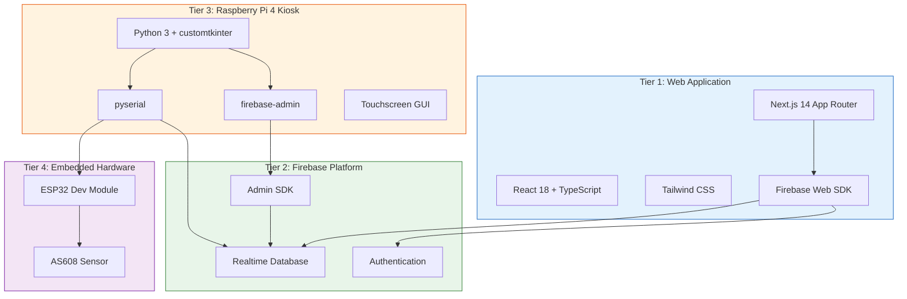
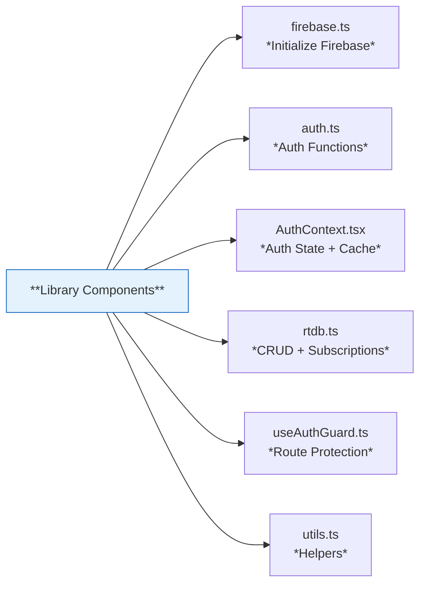
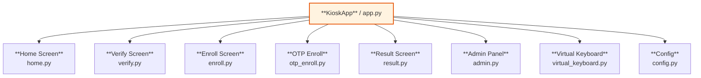
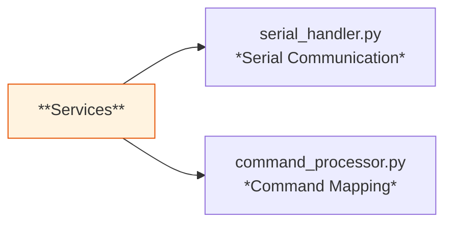
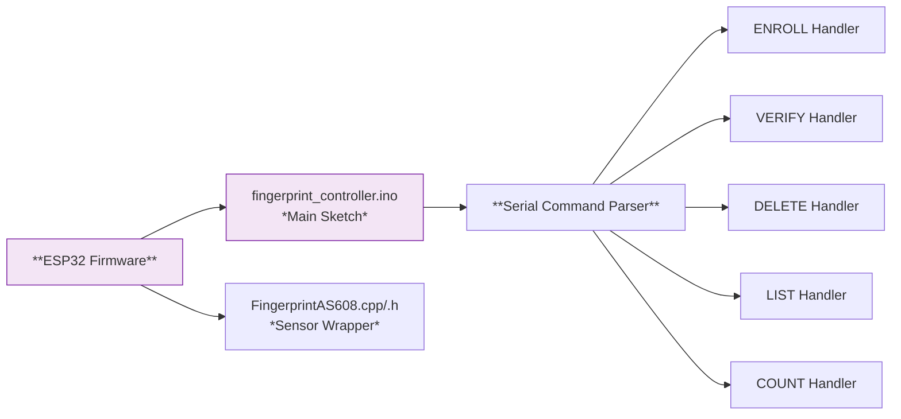
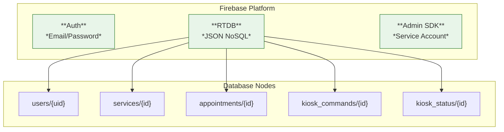
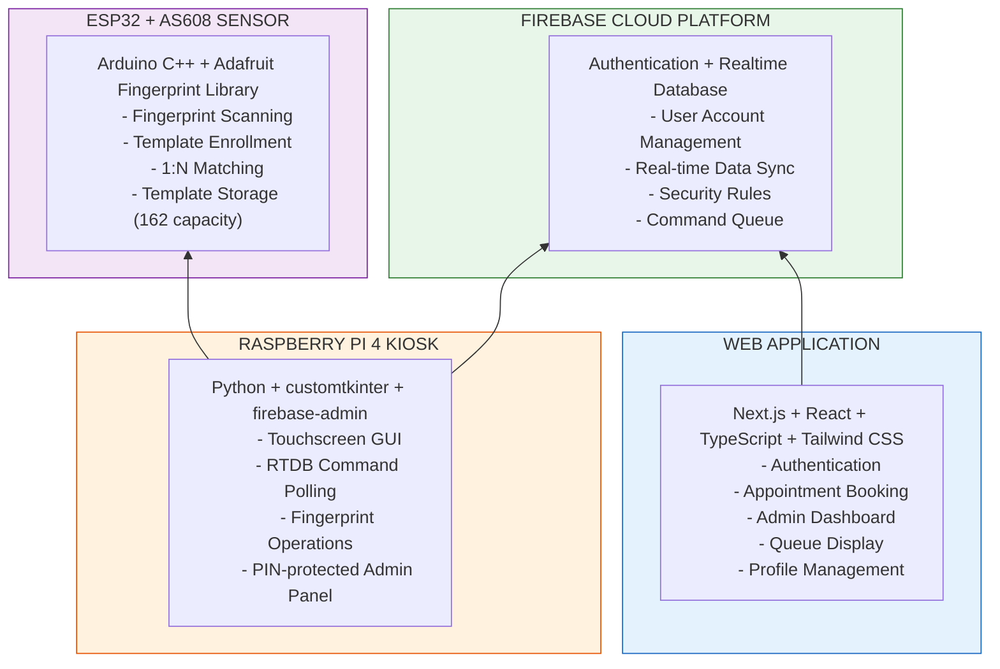

# Component Details

## System Component Overview

The Smart Appointment Scheduling Kiosk system consists of four primary tiers with multiple components. This document provides detailed information about each component, its responsibilities, interfaces, and dependencies.

---

## System Architecture (Component View)

---

## Tier 1: Web Application (src/web/)

### 1.1 Next.js Application (`src/web/src/app/`)

| Property | Details |
|----------|---------|
| **Technology** | Next.js 14 (App Router) |
| **Language** | TypeScript 5.5 |
| **Deployment** | Vercel |
| **Entry Point** | `src/web/src/app/layout.tsx` |

**Page Components:**

| Page | Route | Purpose |
|------|-------|---------|
| `page.tsx` | `/` | Landing page with service overview |
| `login/page.tsx` | `/login` | User authentication |
| `register/page.tsx` | `/register` | New account registration |
| `booking/page.tsx` | `/booking` | Multi-step appointment booking flow |
| `my-appointments/page.tsx` | `/my-appointments` | Manage appointments, OTP enrollment |
| `profile/page.tsx` | `/profile` | Edit resident profile |
| `kiosk/page.tsx` | `/kiosk` | Public queue display (read-only) |
| `dolores-taytay-admin/page.tsx` | `/dolores-taytay-admin` | Admin dashboard |
| `settings/page.tsx` | `/settings` | System settings |

### 1.2 Library Components (`src/web/src/lib/`)

| Component | File | Purpose |
|-----------|------|---------|
| **Firebase Init** | `firebase.ts` | Initialize Firebase app with environment variables |
| **Auth Functions** | `auth.ts` | Sign in, sign up, sign out, password reset |
| **Auth Context** | `AuthContext.tsx` | React context for auth state + localStorage session caching |
| **RTDB Operations** | `rtdb.ts` | CRUD operations and real-time subscriptions for RTDB |
| **Auth Guard** | `useAuthGuard.ts` | Route protection hook (redirect to login if unauthenticated) |
| **Utilities** | `utils.ts` | Time formatters, helper functions |

### 1.3 Type Definitions (`src/web/src/types/`)

| File | Purpose |
|------|---------|
| `index.ts` | TypeScript interfaces for Users, Services, Appointments, Kiosk data |

### 1.4 UI Components (`src/web/src/components/`)

| Component | Purpose |
|-----------|---------|
| `Providers.tsx` | React context providers wrapper (AuthProvider, etc.) |
| `MobileBackButton.tsx` | Mobile-responsive back navigation button |

---

## Tier 2: Raspberry Pi 4 Kiosk (src/rpi/)

### 2.1 Entry Point (`src/rpi/main.py`)

| Property | Details |
|----------|---------|
| **Purpose** | Application entry point |
| **Action** | Creates the root window, initializes the KioskApp |

### 2.2 GUI Layer (`src/rpi/gui/`)

#### KioskApp (`app.py`)

| Property | Details |
|----------|---------|
| **Class** | `KioskApp` |
| **Purpose** | Main application orchestrator tying Firebase, Serial, and UI screens |
| **Dependencies** | firebase-admin, pyserial, customtkinter |

**Responsibilities:**
- Initialize Firebase connection
- Initialize serial connection to ESP32
- Manage screen transitions
- Handle global events and error states

#### Config (`config.py`)

| Property | Details |
|----------|---------|
| **Purpose** | Centralized configuration constants |
| **Contents** | Colors, fonts, screen scaling, auth constants, timing values |

#### Virtual Keyboard (`virtual_keyboard.py`)

| Property | Details |
|----------|---------|
| **Purpose** | On-screen keyboard for touchscreen input |
| **Use Case** | Admin PIN entry, search fields |

#### Screen: Home (`screens/home.py`)

| Property | Details |
|----------|---------|
| **Purpose** | Main kiosk home screen |
| **Features** | Current queue display, date/time, status indicators |

#### Screen: Verify (`screens/verify.py`)

| Property | Details |
|----------|---------|
| **Purpose** | Fingerprint verification screen |
| **Features** | Place finger animation, live status updates, match/no-match result |

#### Screen: Enroll (`screens/enroll.py`)

| Property | Details |
|----------|---------|
| **Purpose** | Fingerprint enrollment screen |
| **Features** | Capture multiple scans, quality check, save to template ID |

#### Screen: OTP Enroll (`screens/otp_enroll.py`)

| Property | Details |
|----------|---------|
| **Purpose** | OTP-based self-enrollment |
| **Features** | Enter OTP from web app, link fingerprint to user account |

#### Screen: Result (`screens/result.py`)

| Property | Details |
|----------|---------|
| **Purpose** | Display check-in result |
| **Success** | Shows appointment details, queue number, success message |
| **Failure** | Shows error reason, retry option |

#### Screen: Admin (`screens/admin.py`)

| Property | Details |
|----------|---------|
| **Purpose** | PIN-protected admin panel |
| **Features** | ESP32 status, template count, manual commands, log viewer |

### 2.3 Services Layer (`src/rpi/services/`)

#### Serial Handler (`serial_handler.py`)

| Property | Details |
|----------|---------|
| **Purpose** | Manages serial communication with ESP32 |
| **Features** | Auto-detect serial port, auto-reconnect on disconnect, send/receive |

**Interface:**

| Command | Format | Description |
|---------|--------|-------------|
| `ENROLL:<id>` | `ENROLL:5` | Enroll fingerprint to template ID |
| `VERIFY` | `VERIFY` | Verify fingerprint (1:N match) |
| `DELETE:<id>` | `DELETE:5` | Delete specific template |
| `LIST` | `LIST` | List all stored templates |
| `COUNT` | `COUNT` | Get template count |
| `STATUS` | `STATUS` | Get ESP32 status |

#### Command Processor (`command_processor.py`)

| Property | Details |
|----------|---------|
| **Purpose** | Maps RTDB commands to ESP32 serial commands |
| **Role** | Bridge between Firebase kiosk_commands and ESP32 |

---

## Tier 3: ESP32 Firmware (src/esp/)

### 3.1 Main Sketch (`fingerprint_controller/fingerprint_controller.ino`)

| Property | Details |
|----------|---------|
| **Platform** | Arduino Framework (C++) |
| **Board** | ESP32 Dev Module |
| **Purpose** | Main firmware handling serial commands and sensor operations |

### 3.2 FingerprintAS608 Class (`fingerprint_controller/FingerprintAS608.cpp` / `.h`)

| Property | Details |
|----------|---------|
| **Class** | `FingerprintAS608` |
| **Purpose** | C++ wrapper around Adafruit Fingerprint Sensor Library |

**Methods:**

| Method | Parameters | Description |
|--------|-----------|-------------|
| `begin()` | `Stream* serial`, `uint32_t baud` | Initialize sensor |
| `enroll()` | `uint16_t id` | Enroll to template ID |
| `verify()` | None | 1:N matching, returns ID or -1 |
| `deleteTemplate()` | `uint16_t id` | Delete template by ID |
| `getTemplateCount()` | None | Get stored template count |
| `listTemplates()` | None | List all template IDs |

### 3.3 AS608 Fingerprint Sensor

| Property | Specification |
|----------|--------------|
| **Model** | AS608 Optical Fingerprint Sensor |
| **Interface** | UART (TTL) |
| **Baud Rate** | 57600 (default) |
| **Voltage** | 3.3V (not 5V!) |
| **Template Capacity** | 162 templates |
| **Library** | Adafruit Fingerprint Sensor Library |

---

## Tier 4: Firebase Cloud Services

### 4.1 Firebase Authentication

| Property | Details |
|----------|--------- |
| **Method** | Email / Password |
| **Users** | Residents (role: "resident"), Admins (role: "admin") |
| **Session** | Firebase Auth JWT (managed by Firebase SDK) |
| **Custom Claims** | Admin role assigned via Firebase Admin SDK |

### 4.2 Firebase Realtime Database (RTDB)

| Property | Details |
|----------|--------- |
| **Format** | JSON NoSQL |
| **Regions** | Real-time sync globally |
| **Security** | Firebase Security Rules (JSON-based) |

**Database Nodes:**

| Node | Purpose |
|------|---------|
| `users/{uid}` | Resident profiles and fingerprint metadata |
| `services/{id}` | Available barangay services |
| `appointments/{id}` | Appointment records |
| `appointments/slot_bookings/{key}` | Atomic slot booking locks (prevent double-booking) |
| `kiosk_commands/{id}` | Command queue for RPi kiosks |
| `kiosk_status/{kiosk_id}` | Kiosk heartbeat and status reports |

---

## Component Interaction Matrix

| From | To | Protocol | Data |
|------|-----|----------|------|
| Web App | Firebase Auth | HTTPS | Email, password |
| Web App | Firebase RTDB | HTTPS / WebSocket | CRUD operations, listeners |
| RPi4 | Firebase RTDB | HTTPS REST | Read commands, write results |
| RPi4 | ESP32 | Serial (115200 baud) | Text commands |
| ESP32 | AS608 | UART (57600 baud) | Binary sensor commands |
| Web App | RPi4 | *Indirect via RTDB* | kiosk_commands, kiosk_status |

---

## Component Responsibility Diagram

