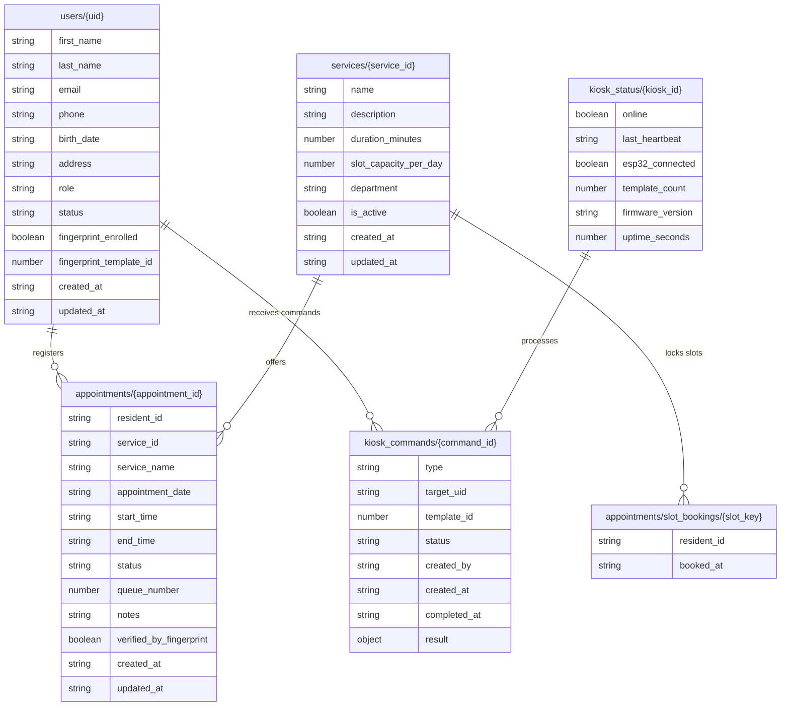
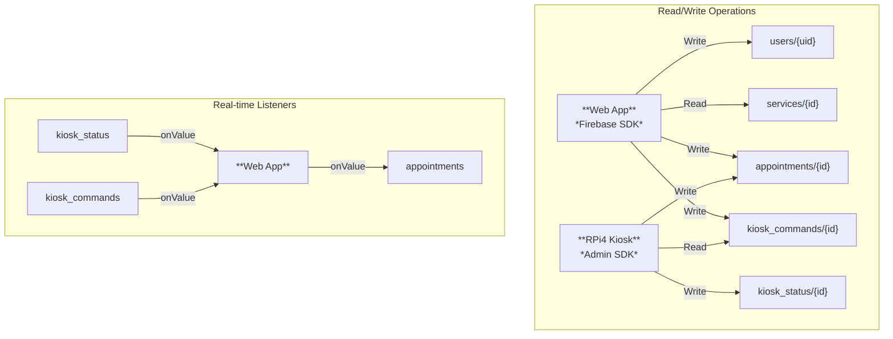

# Database Schema

## Overview

This system uses **Firebase Realtime Database (RTDB)** as its primary data store. RTDB is a NoSQL cloud-hosted database that synchronizes data in real-time across all connected clients.

**Key characteristics:**
- Data is stored as a JSON tree structure
- Supports real-time listeners via WebSocket (Firebase SDK handles this automatically)
- No joins or complex queries (denormalized data structure)
- Security rules control access per node

---

## Database Entity Diagram



---

## Data Structure

### `users/{uid}`

Resident and admin profiles linked to Firebase Authentication.

```json
{
  "users": {
    "uid_abc123": {
      "first_name": "Juan",
      "last_name": "Dela Cruz",
      "email": "juan@example.com",
      "phone": "09171234567",
      "birth_date": "1990-01-15",
      "address": "123 Street, Barangay Dolores, Taytay, Rizal",
      "role": "resident",
      "status": "active",
      "fingerprint_enrolled": true,
      "fingerprint_template_id": 7,
      "created_at": "2026-06-25T08:00:00Z",
      "updated_at": "2026-06-25T08:00:00Z"
    }
  }
}
```

| Field | Type | Description |
|-------|------|-------------|
| `first_name` | string | First name |
| `last_name` | string | Last name |
| `email` | string | Email address (must match Firebase Auth) |
| `phone` | string | Mobile number (e.g., 09171234567) |
| `birth_date` | string | Date of birth (ISO format) |
| `address` | string | Home address |
| `role` | string | `"resident"` or `"admin"` |
| `status` | string | `"pending"`, `"active"`, or `"suspended"` |
| `fingerprint_enrolled` | boolean | Whether a fingerprint has been enrolled |
| `fingerprint_template_id` | number | AS608 template ID (0-161) |
| `created_at` | string | ISO 8601 timestamp |
| `updated_at` | string | ISO 8601 timestamp |

---

### `services/{service_id}`

Available Barangay services that residents can book.

```json
{
  "services": {
    "svc_clearance": {
      "name": "Barangay Clearance",
      "description": "Request for barangay clearance certificate",
      "duration_minutes": 30,
      "slot_capacity_per_day": 20,
      "department": "Administrative",
      "is_active": true,
      "created_at": "2026-01-01T00:00:00Z",
      "updated_at": "2026-06-15T10:00:00Z"
    }
  }
}
```

| Field | Type | Description |
|-------|------|-------------|
| `name` | string | Service name |
| `description` | string | Detailed description |
| `duration_minutes` | number | How long the service takes |
| `slot_capacity_per_day` | number | Max appointments per day |
| `department` | string | Which department handles this |
| `is_active` | boolean | Whether the service is currently offered |

---

### `appointments/{appointment_id}`

Individual appointment records.

``` Leic```json
{
  "appointments": {
    "appt_001": {
      "resident_id": "uid_abc123",
      "service_id": "svc_clearance",
      "service_name": "Barangay Clearance",
      "appointment_date": "2026-06-25",
      "start_time": "09:00",
      "end_time": "09:30",
      "status": "scheduled",
      "queue_number": 15,
      "notes": "New resident",
      "verified_by_fingerprint": false,
      "created_at": "2026-06-24T10:30:00Z",
      "updated_at": "2026-06-24T10:30:00Z"
    }
  }
}
```

| Field | Type | Description |
|-------|------|-------------|
| `resident_id` | string | Reference to `users/{uid}` |
| `service_id` | string | Reference to `services/{id}` |
| `service_name` | string | Cached service name (denormalized) |
| `appointment_date` | string | Date (YYYY-MM-DD) |
| `start_time` | string | Start time (HH:MM) |
| `end_time` | string | End time (HH:MM) |
| `status` | string | `"scheduled"`, `"checked_in"`, `"completed"`, `"cancelled"`, `"no_show"` |
| `queue_number` | number | Assigned sequential number for the day |
| `notes` | string | Optional notes |
| `verified_by_fingerprint` | boolean | Whether checked in via fingerprint |
| `created_at` | string | ISO 8601 timestamp |
| `updated_at` | string | ISO 8601 timestamp |

---

### `appointments/slot_bookings/{slot_key}`

Atomic slot booking locks to prevent double-booking.

```json
{
  "appointments": {
    "slot_bookings": {
      "svc_clearance_2026-06-25_09:00": {
        "resident_id": "uid_abc123",
        "booked_at": "2026-06-24T10:30:00Z"
      }
    }
  }
}
```

| Field | Type | Description |
|-------|------|-------------|
| `{slot_key}` | string | Composite key: `{service_id}_{date}_{time}` |
| `resident_id` | string | Who booked this slot |
| `booked_at` | string | ISO 8601 timestamp |

---

### `kiosk_commands/{command_id}`

Command queue for RPi kiosks. The web app writes commands here; RPi4 polls and executes them.

```json
{
  "kiosk_commands": {
    "cmd_001": {
      "type": "enroll",
      "target_uid": "uid_abc123",
      "template_id": 7,
      "status": "pending",
      "created_by": "admin_uid",
      "created_at": "2026-06-25T08:00:00Z",
      "completed_at": null,
      "result": null
    }
  }
}
```

| Field | Type | Description |
|-------|------|-------------|
| `type` | string | `"verify"`, `"enroll"`, or `"delete"` |
| `target_uid` | string | User ID (for enroll/verify) |
| `template_id` | number | AS608 template ID (for enroll/delete) |
| `status` | string | `"pending"`, `"processing"`, `"completed"`, or `"failed"` |
| `created_by` | string | Admin or system UID |
| `created_at` | string | ISO 8601 timestamp |
| `completed_at` | string | ISO 8601 timestamp (or null) |
| `result` | object | Command result (or null) |

**Result object examples:**
```json
// Enroll result
{
  "success": true,
  "template_id": 7,
  "message": "Enrollment successful"
}

// Verify result
{
  "success": true,
  "template_id": 7,
  "matched_user_id": "uid_abc123",
  "confidence": 95
}

// Delete result
{
  "success": true,
  "template_id": 7,
  "message": "Template deleted"
}
```

---

### `kiosk_status/{kiosk_id}`

Real-time status and heartbeat for each physical kiosk.

```json
{
  "kiosk_status": {
    "kiosk_main": {
      "online": true,
      "last_heartbeat": "2026-06-25T08:05:00Z",
      "esp32_connected": true,
      "template_count": 45,
      "firmware_version": "1.0.0",
      "uptime_seconds": 3600
    }
  }
}
```

| Field | Type | Description |
|-------|------|-------------|
| `online` | boolean | Whether the kiosk is connected |
| `last_heartbeat` | string | Last time kiosk reported in |
| `esp32_connected` | boolean | Whether ESP32 is detected |
| `template_count` | number | Number of fingerprint templates stored |
| `firmware_version` | string | ESP32 firmware version |
| `uptime_seconds` | number | How long kiosk has been running |

---

## Data Flow Visualization



---

## Denormalization Strategy

Firebase RTDB does not support JOINs. Common denormalizations include:

| Denormalized Data | Source | Reason |
|------------------|--------|--------|
| `appointments/{id}/service_name` | `services/{id}/name` | Avoid second lookup for display |
| `users/{uid}/fingerprint_template_id` | ESP32 flash | Link user to fingerprint template |
| `kiosk_commands/{id}/target_uid` | `users/{uid}` | Target user for command |
