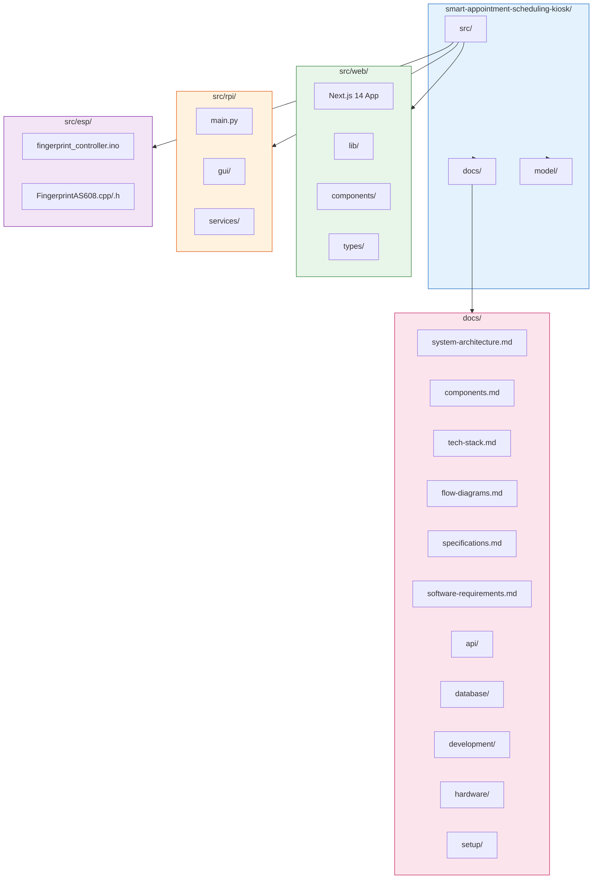
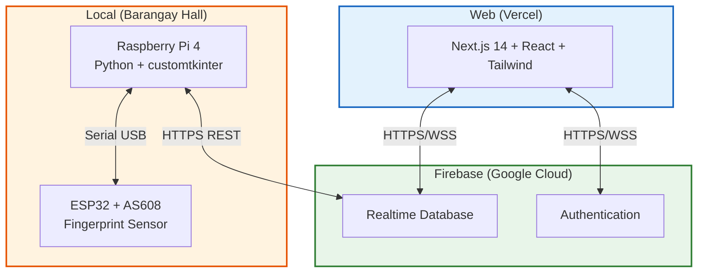
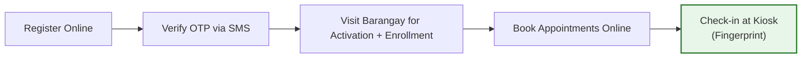
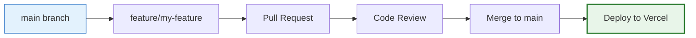

# Development Guide

## Project Structure



---

## Development Workflow

### 1. Web Application

```bash
cd src/web
npm install
npm run dev          # http://localhost:3000
npm run build        # Static export
```

| Command | Description |
|---------|-------------|
| `npm run dev` | Start Next.js dev server |
| `npm run build` | Build static export |
| `npm run start` | Start production server |
| `npm run lint` | Run ESLint |

### 2. RPi4 Kiosk

```bash
cd src/rpi
pip install -r requirements.txt
python main.py
```

### 3. ESP32 Firmware

Open Arduino IDE and select: `src/esp/fingerprint_controller/fingerprint_controller.ino`

| Setting | Value |
|---------|-------|
| Board | ESP32 Dev Module |
| Upload Speed | 921600 baud |
| Port | (your COM port) |
| Flash Mode | QIO |
| Flash Size | 4MB |

---

## Architecture



---

## User Flow



---

## Testing Strategy

### Web Application
- Manual testing in Chrome, Firefox, Safari
- Test responsive design on mobile viewport
- Verify Firebase real-time sync with multiple browsers

### RPi4 Kiosk
- Test serial auto-reconnect by unplugging/replugging ESP32
- Test touch input on actual touchscreen
- Test kiosk boot with systemd service

### ESP32 Firmware
- Upload firmware and verify in Serial Monitor
- Test each command: ENROLL, VERIFY, DELETE, LIST, COUNT
- Check for watchdog resets after long idle periods

---

## Environment Variables

### Web (`.env.local`)
```bash
NEXT_PUBLIC_FIREBASE_API_KEY=your_api_key
NEXT_PUBLIC_FIREBASE_AUTH_DOMAIN=your_project.firebaseapp.com
NEXT_PUBLIC_FIREBASE_PROJECT_ID=your_project_id
NEXT_PUBLIC_FIREBASE_STORAGE_BUCKET=your_project.appspot.com
NEXT_PUBLIC_FIREBASE_MESSAGING_SENDER_ID=123456789
NEXT_PUBLIC_FIREBASE_APP_ID=1:123456789:web:abcdef
NEXT_PUBLIC_FIREBASE_DATABASE_URL=https://your_project_id-default-rtdb.firebaseio.com
```

### RPi (`.env`)
```bash
FIREBASE_CREDENTIALS=/path/to/firebase-service-account.json
FIREBASE_DATABASE_URL=https://your_project-default-rtdb.firebaseio.com
FIREBASE_STORAGE_BUCKET=your_project.appspot.com
SERIAL_PORT=/dev/ttyUSB0
SERIAL_BAUD=115200
KIOSK_ID=kiosk_main
```

---

## Git Workflow



---

## Troubleshooting

| Issue | Solution |
|-------|----------|
| RPi4 cannot connect to Firebase | Check `.env` creds; verify internet; check service account JSON permissions |
| ESP32 not detected | Check `ls /dev/ttyUSB*` or `ls /dev/ttyACM*`; try different USB cable/port |
| AS608 sensor not responding | Verify wiring (VCC to 3.3V); check baud rate (57600); check GND connection |
| Web app cannot write to RTDB | Check security rules; ensure user is authenticated |
| Touchscreen not working | Check HDMI and USB connections; calibrate if needed |
| systemd service fails to start | Run `sudo journalctl -u kiosk-firebase -f` to see error |
| ESP32 watchdog622 watchdog reset | Add `delay()` or `yield()` in loops; ensure stable power supply |
