# Flow Diagrams & Sequence Charts (Updated — Actual Codebase)

This document contains detailed Mermaid diagrams illustrating the key processes and data flows in the Smart Appointment Scheduling Kiosk system. All commands and flows reflect the **actual built system** at `git HEAD`.

---

## 1. System-Level Data Flow Diagram

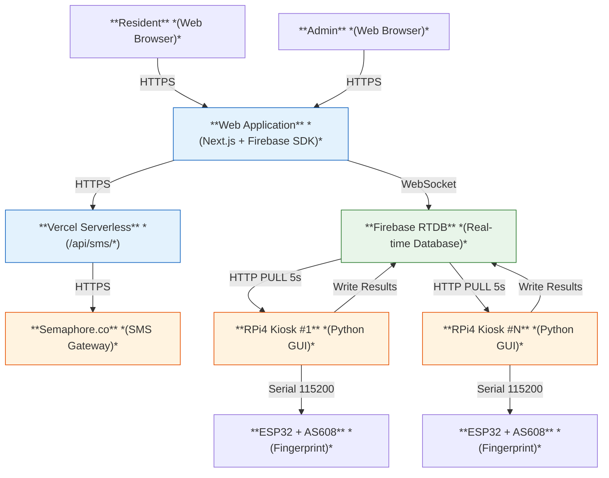

---

## 2. Appointment Booking Flow (with Atomic Slot Lock + OTP)

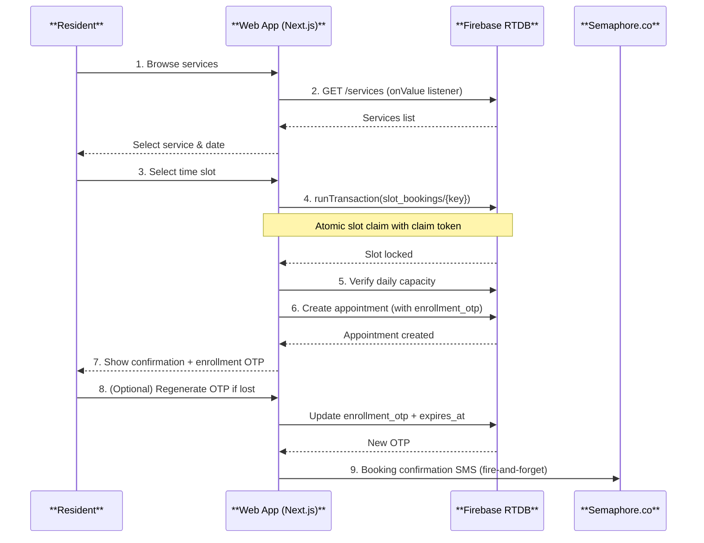

### Booking Data Flow Detail

```
createAppointment(data, dailyCapacity):
  1. slotKey = sanitizeKey(serviceId + date + start + end)
  2. claimToken = unique random string
  3. runTransaction(slotRef):
       if slot occupied → return current (no change)
       else → return claimToken
  4. Verify claim: get(slotRef) === claimToken
  5. Count today's active appointments for this service
  6. if >= dailyCapacity → release slot, throw Error
  7. Generate enrollment OTP (6-digit, 24h expiry)
  8. push() + set() → new appointment record
  9. set(slotRef, newRef.key)
  10. Return { id, otp }
```

---

## 3. Fingerprint Check-In Flow (Actual)

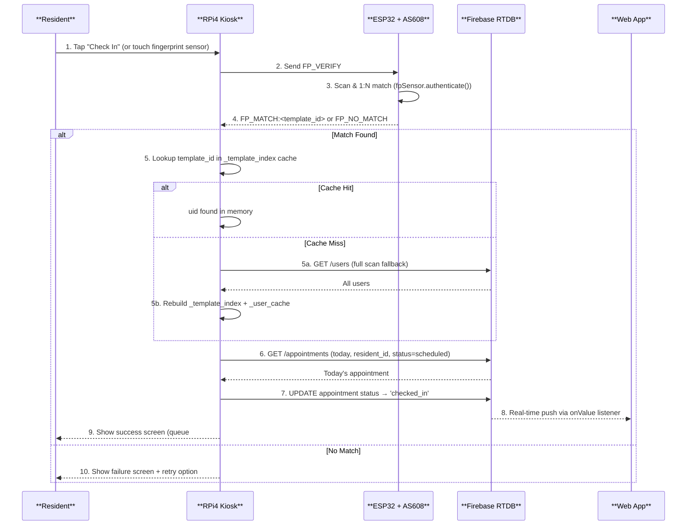

---

## 4. Fingerprint Enrollment Flow (Admin-triggered)

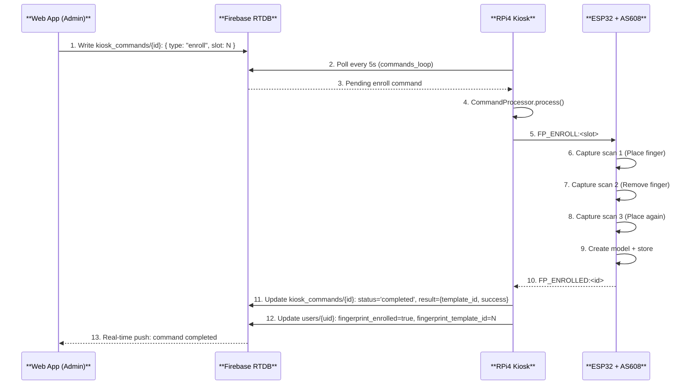

---

## 5. OTP-Based Self-Enrollment Flow

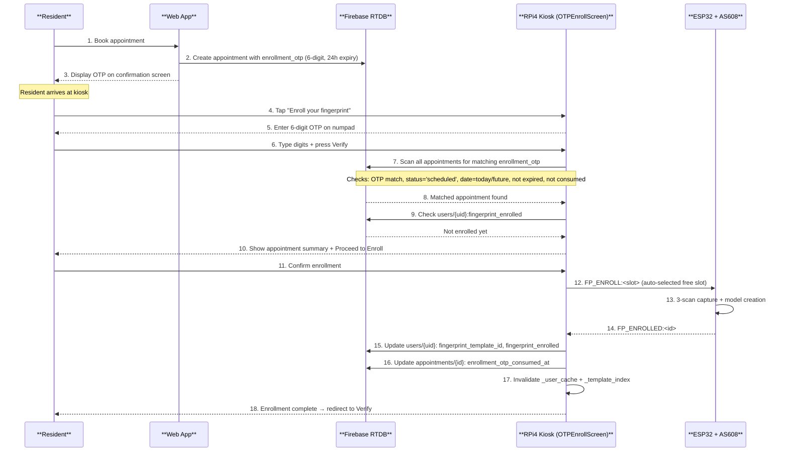

---

## 6. Real-Time Queue Update Flow

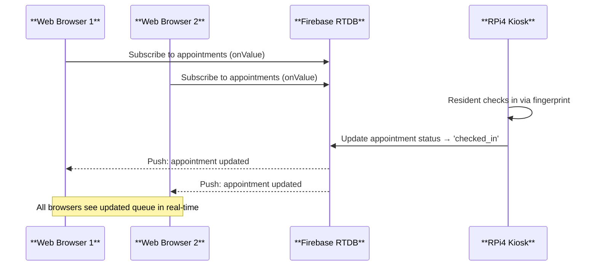

---

## 7. ESP32 Fingerprint Operations Flow (Actual Commands)

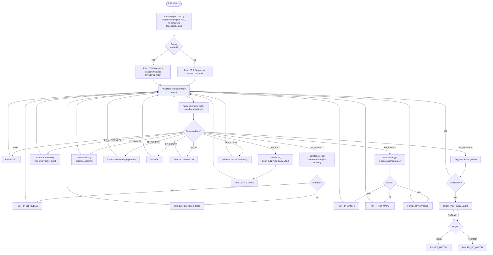

---

## 8. Kiosk Boot & Initialization Flow

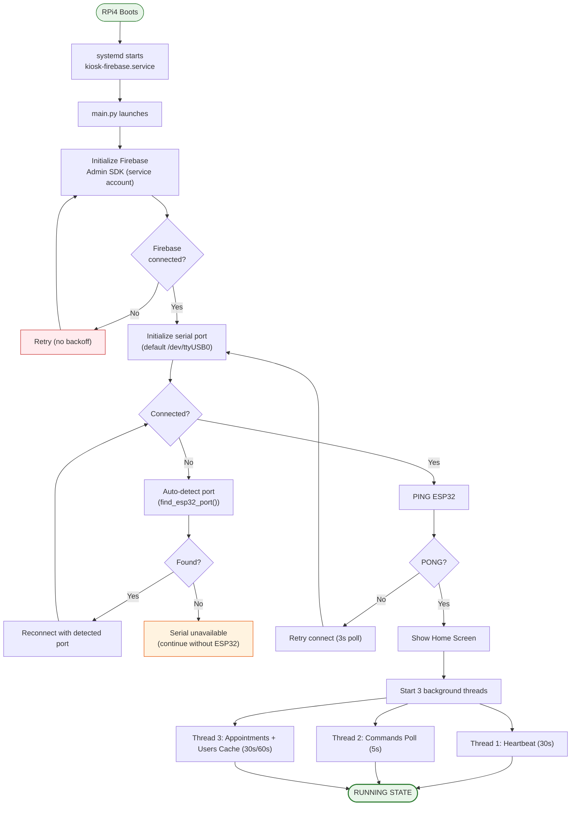

---

## 9. Web App Authentication & Registration Flow

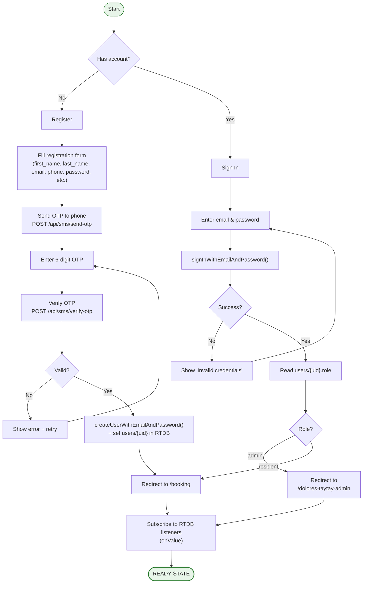

---

## 10. Stateless HMAC OTP Flow

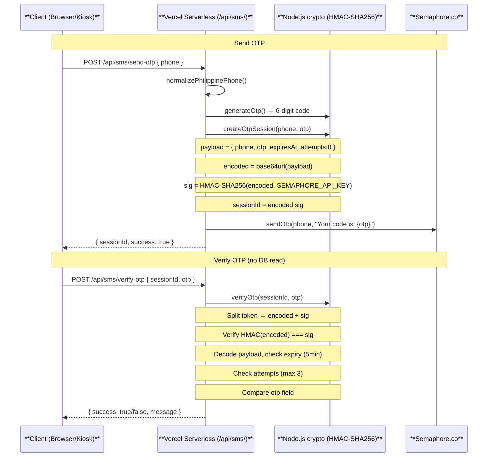

---

## 11. SMS Reminder Flow (Cron Script)

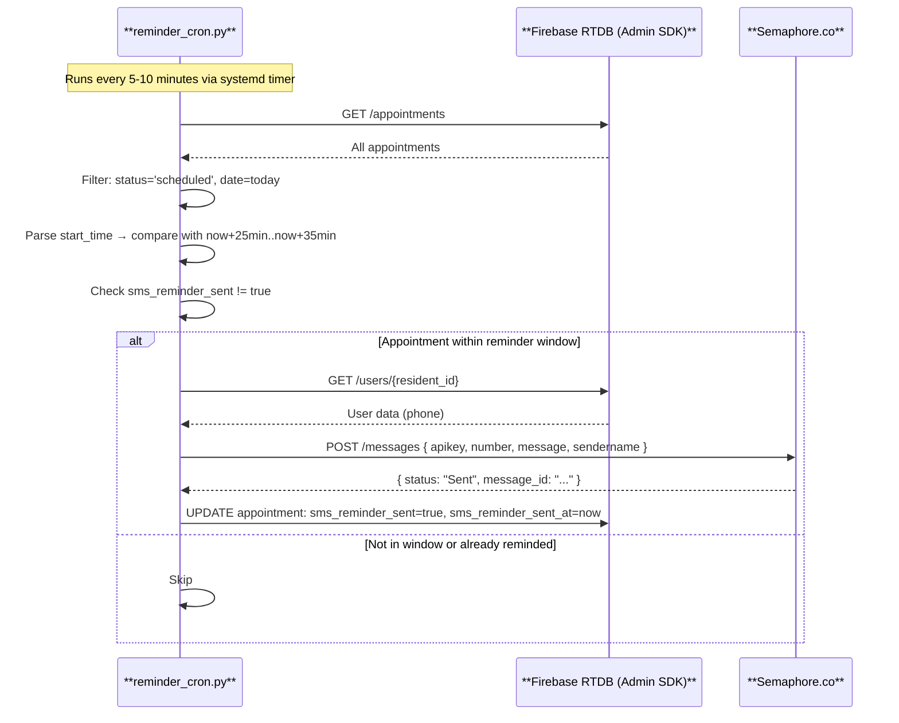

---

## 12. Error Recovery: Serial Reconnection Flow

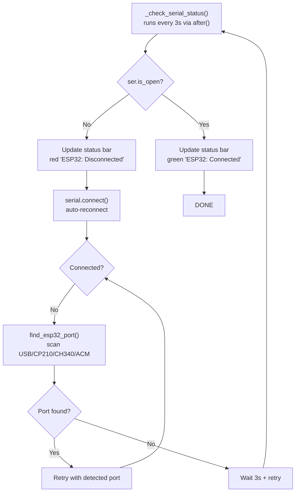
