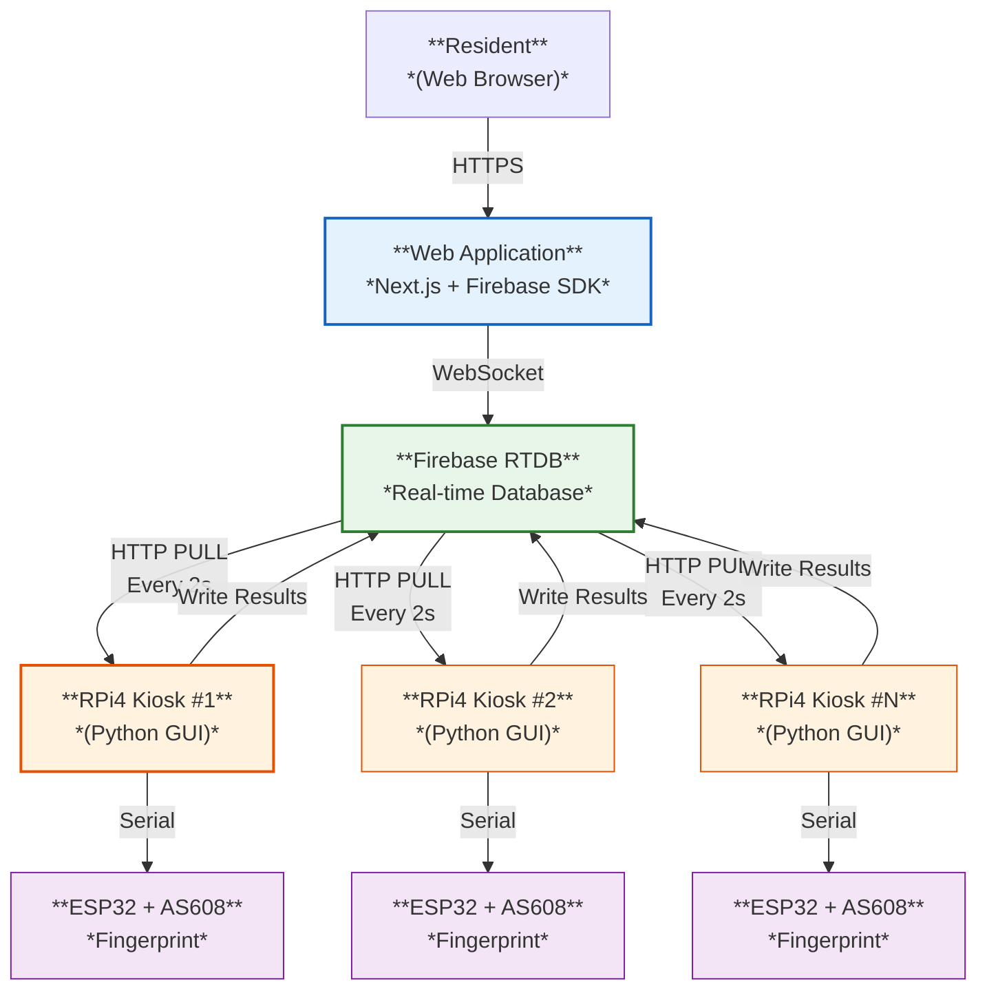
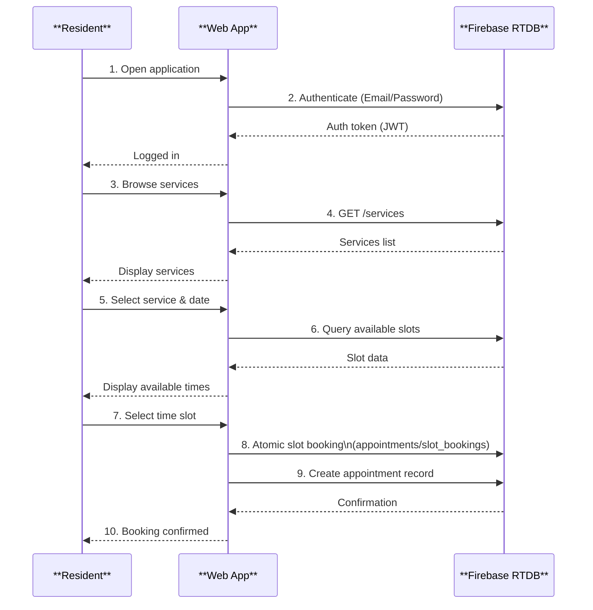
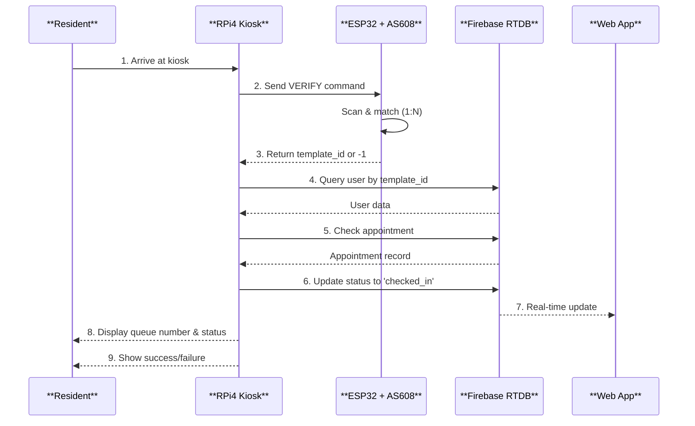
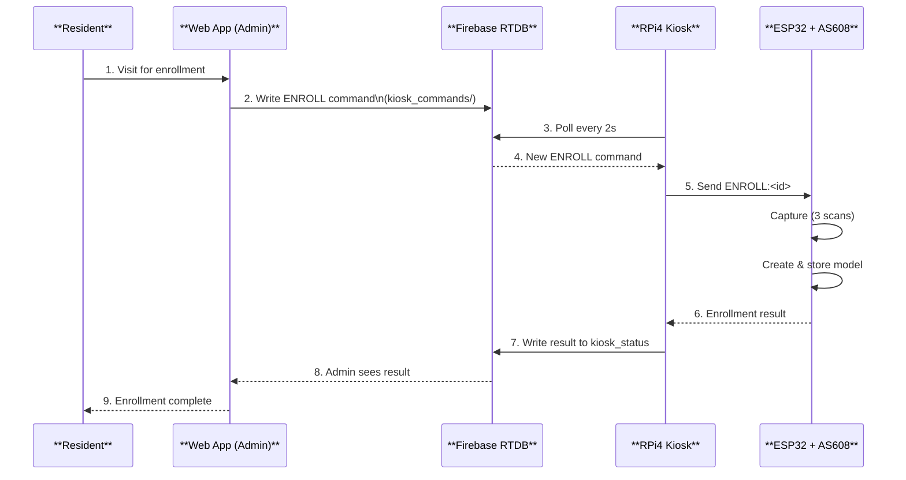
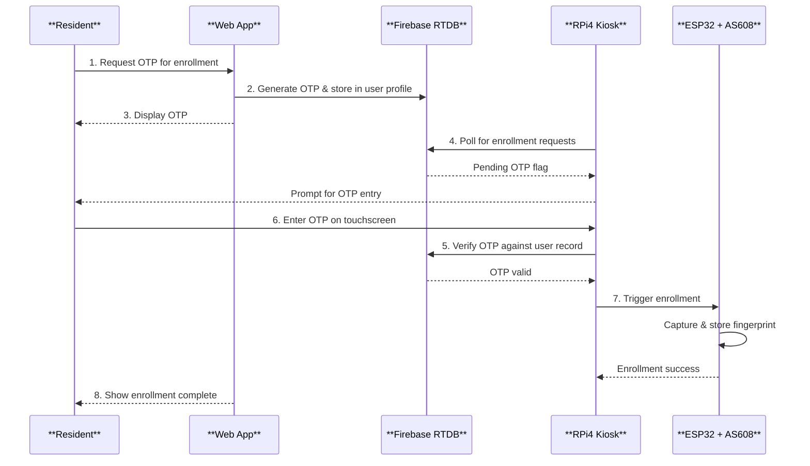
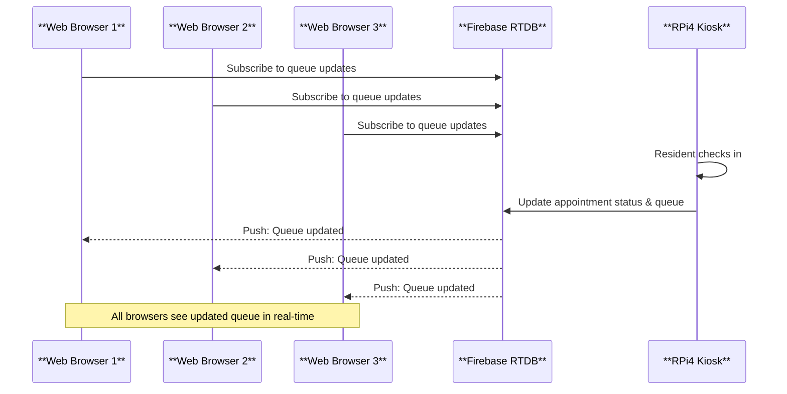
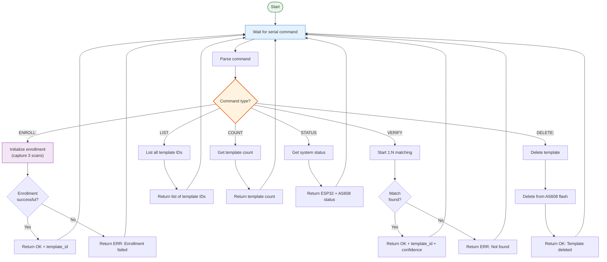
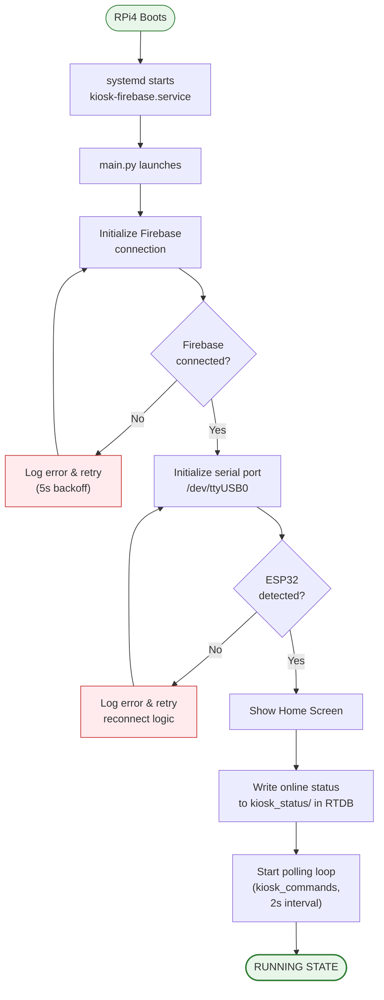
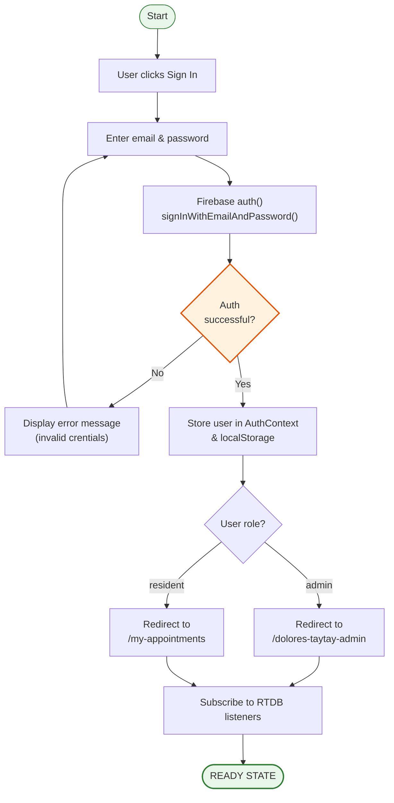
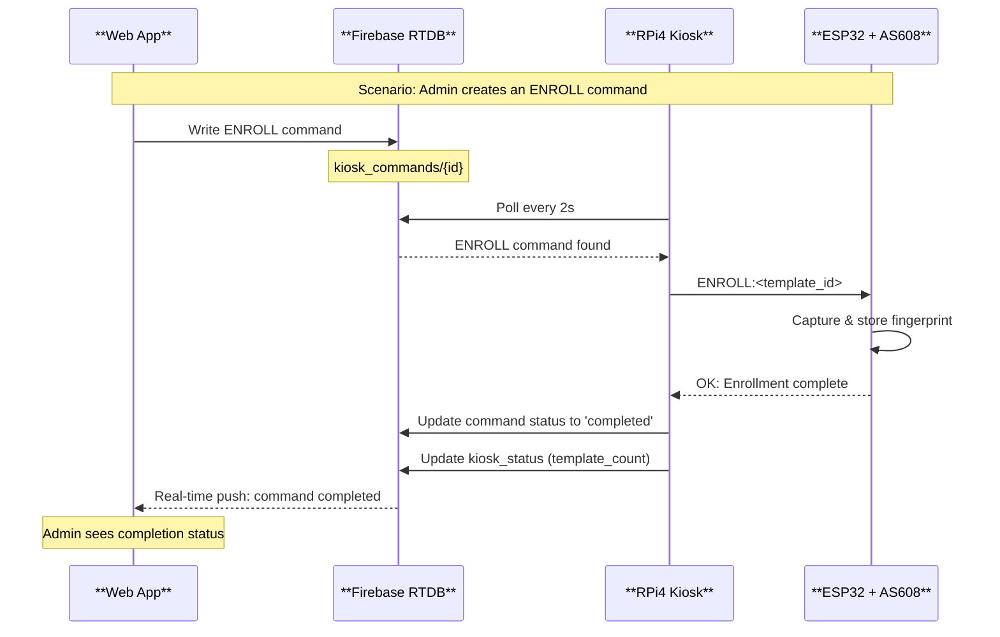

# Flow Diagrams & Sequence Charts

This document contains detailed Mermaid diagrams illustrating the key processes and data flows in the Smart Appointment Scheduling Kiosk system.

---

## 1. System-Level Data Flow Diagram

---

## 2. Appointment Booking Flow (Sequence Diagram)

---

## 3. Fingerprint Check-In Flow

---

## 4. Fingerprint Enrollment Flow

---

## 5. OTP-Based Self-Enrollment Flow

---

## 6. Real-Time Queue Update Flow

---

## 7. ESP32 Fingerprint Operations Flow

---

## 8. Kiosk Boot & Initialization Flow

---

## 9. Web App Authentication Flow

---

## 10. Data Synchronization Flow

