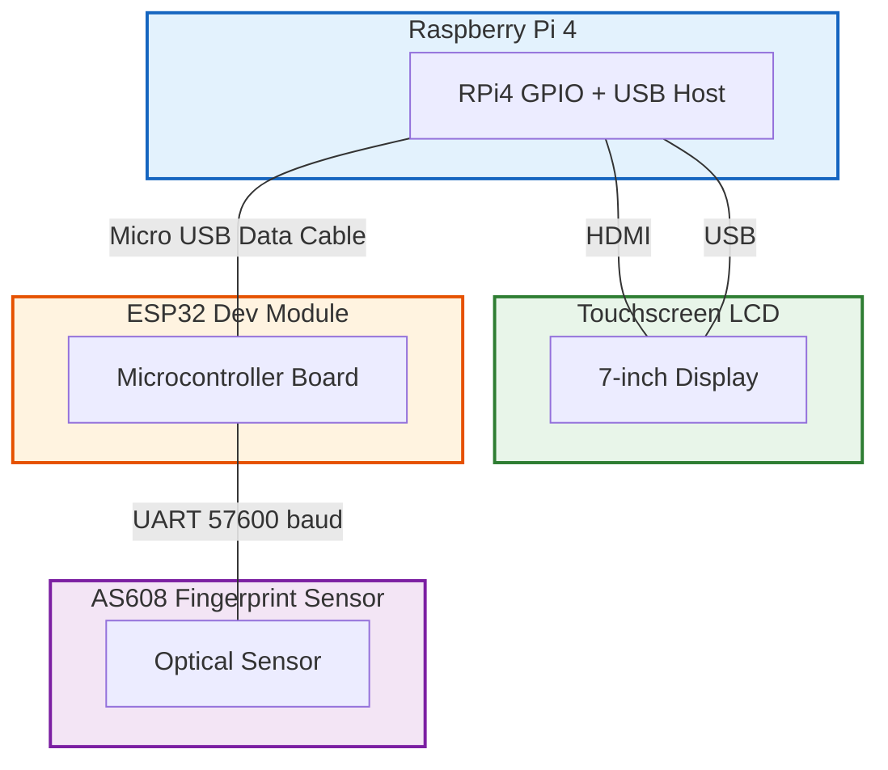
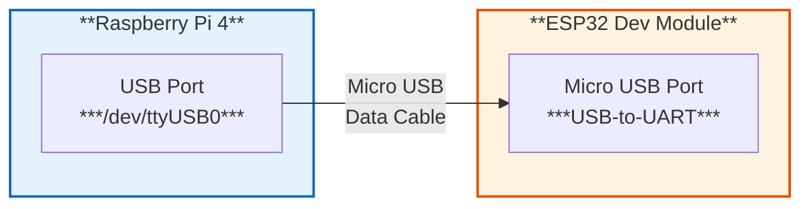
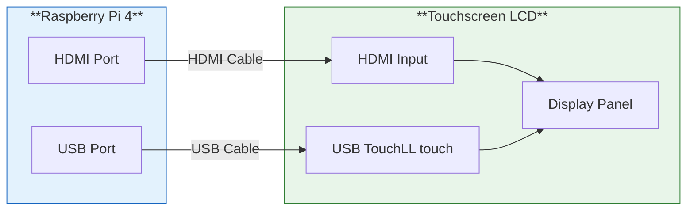
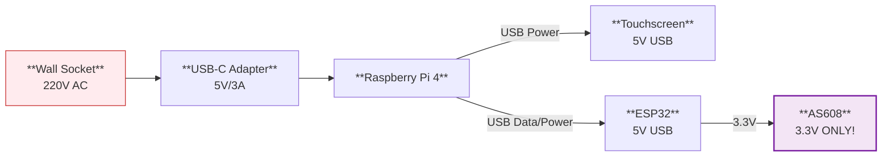
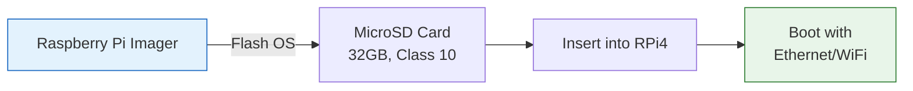

# Hardware Setup Guide

## Bill of Materials

| # | Component | Model / Specs | Qty | Notes |
|---|-----------|-------------|-----|-------|
| 1 | Raspberry Pi 4 Model B | 4GB RAM, 64-bit | 1 | Main kiosk computer |
| 2 | ESP32 Development Board | ESP32-D0WDQ6, 30-pin | 1 | Fingerprint controller |
| 3 | AS608 Fingerprint Sensor | Optical, UART | 1 | Biometric scanner |
| 4 | Touchscreen LCD | 10-inch, capacitive | 1 | User interface |
| 5 | MicroSD Card | 32GB, Class 10 | 1 | RPi4 storage |
| 6 | USB-C Power Adapter | 5V/3A | 1 | RPi4 power |
| 7 | Micro USB Cable | Data + power | 1 | ESP32 to RPi4 |
| 8 | Raspberry Pi Case | With touchscreen mount | 1 | Optional but recommended |
| 9 | Enclosure / 3D Printed Case | Custom kiosk housing | 1 | Optional |

---

## System Wiring Overview



## Wiring Diagrams

### 1. ESP32 to AS608 Fingerprint Sensor

**IMPORTANT:** The AS608 sensor operates at **3.3V ONLY**. Do NOT connect to 5V.

| ESP32 Pin | AS608 Pin | Wire Color | Description |
|-----------|-----------|------------|-------------|
| 3.3V | VCC | Red | Power supply (3.3V) |
| GND | GND | Black | Ground |
| GPIO16 (RX2) | TX (White) | White | Serial data from AS608 |
| GPIO17 (TX2) | RX (Green) | Green | Serial data to AS608 |

```mermaid
graph LR
    subgraph ESP32["**ESP32 Dev Module**"]
        P1["**3.3V**
        Power"]
        P2["**GND**
        Ground"]
        P3["**GPIO16**
        RX2"]
        P4["**GPIO17**
        TX2"]
    end

    subgraph AS608["**AS608 Sensor**"]
        Q1["**VCC"
        Power"]
        Q2["**GND**
        Ground"]
        Q3["**TX**
        Transmit"]
        Q4["**RX**
        Receive**"]
    end

    P1 -.->|Red| Q1
    P2 -.->| Building
Black| Q2
    P3 -.->|White| Q3
    P4 -.->|Green| Q4

    style ESP32 fill:#fff3e0,stroke:#e65100
    style AS608 fill:#f3e5f5,stroke:#7b1fa2
```

### 2. ESP32 to Raspberry Pi 4

The ESP32 connects to the RPi4 via **micro USB cable**.



**You do NOT need to connect UART/GPIO pins directly.** The ESP32 and RPi4 communicate over USB Serial at 115200 baud.

### 3. Touchscreen to RPi4

| RPi4 Connection | Touchscreen Connection |
|------------------|----------------------|
| HDMI Port | HDMI Cable |
| USB Port | USB (Touch) |
| 5V/GND (via GPIO) | Power (if not HDMI-powered) |



### 4. Power Connections

| Device | Power Input | Connection | Source |
|--------|------------|------------|--------|
| RPi4 | 5V/3A | USB-C power adapter | Wall socket |
| Touchscreen | 5V | USB (or GPIO) | RPi4 |
| ESP32 | 5V | Via USB | RPi4 (or external) |
| AS608 | 3.3V | Jumper wire | ESP32 |



---

## Assembly Steps

### Step 1: Prepare the Raspberry Pi 4



1. Flash Raspberry Pi OS Lite (64-bit) to the MicroSD card using [Raspberry Pi Imager](https://www.raspberrypi.com/software/)
2. Enable SSH and Wi-Fi (if needed) before first boot
3. Insert the MicroSD card into the RPi4
4. Boot up the RPi4

### Step 2: Connect the Touchscreen

1. Connect the touchscreen to the RPi4 using an **HDMI cable**
2. Connect the touchscreen's USB cable to any RPi4 USB port
3. Power up the display and verify touch input works

### Step 3: Wire the AS608 to the ESP32

1. **Double-check** all wiring with a multimeter (VCC should be 3.3V)
2. Connect the 4 jumper wires:
   - AS608 VCC  -> ESP32 3.3V (not 5V!)
   - AS608 GND  -> ESP32 GND
   - AS608 TX   -> ESP32 GPIO16 (RX2)
   - AS608 RX   -> ESP32 GPIO17 (TX2)
3. Ensure the connections are secure and not loose

### Step 4: Connect the ESP32 to the RPi4

1. Connect the ESP32 to the RPi4 using a **micro USB cable**
2. Verify the RPi4 detects the ESP32:
   ```bash
   ls /dev/ttyUSB* /dev/ttyACM*
   ```
   You should see something like `/dev/ttyUSB0`

### Step 5: Enable Serial Port on RPi4

```bash
sudo raspi-config
```

Navigate to: **Interface Options > Serial Port**
- **No** - "Would you like a login shell to be accessible over serial?"
- **Yes** - "Would you like the serial port hardware to be enabled?"

Reboot:
```bash
sudo reboot
```

### Step 6: Verification

```bash
# Check if the ESP32 serial port is available
ls /dev/ttyUSB*
# Output: /dev/ttyUSB0
```

Upload the firmware first:
1. Open Arduino IDE and select **Tools > Serial Monitor**
2. Set baud rate to **115200**
3. Upload the `fingerprint_controller.ino` sketch
4. You should see: `OK:ESP32 ready`

---

## Raspberry Pi OS Configuration

### Update and Install Required Packages

```bash
sudo apt update
sudo apt full-upgrade -y
sudo apt install -y python3-pip python3-venv python3-tk git curl
```

### Enable Auto-Login

```bash
sudo raspi-config
# System Options > Boot / Auto Login > Console Autologin
```

### Disable Screen Saver / Power Management

Edit `~/.config/lxsession/LXDE-pi/autostart`:
```bash
sudo nano ~/.config/lxsession/LXDE-pi/autostart
```

Add:
```
@xset s off
@xset -dpms
@xset s noblank
```

---

## Troubleshooting

### Fingerprint sensor not detected
- **Check voltage:** Verify AS608 VCC pin is connected to 3.3V, NOT 5V
- **Check wiring:** TX from AS608 goes to RX on ESP32 (crossed) and vice versa
- **Check baud rate:** The default AS608 baud is 57600 (configured in the Arduino code)
- **Verify with Serial Monitor:** Use Arduino IDE > Serial Monitor to see debug output

### Serial communication issues
- **Verify port:** Run `ls /dev/ttyUSB* /dev/ttyACM*` on the RPi4
- **Check permissions:** Ensure the `pi` user has access to the serial port: `ls -l /dev/ttyUSB0`
- **Ground loop:** Ensure ESP32 and RPi4 share a common ground (shared by USB cable)
- **Auto-reconnect:** The RPi4 application has auto-reconnect logic, but a manual restart may help

### Touchscreen not responding
- Check the USB connection to the RPi4 (touch uses USB, not HDMI)
- Try a different USB port
- Update touchscreen drivers: `sudo apt update && sudo apt upgrade`
- Test with `xinput` or `evtest`

### ESP32 not starting
- Check the micro USB cable is a **data cable** (not charge-only)
- Verify the ESP32 power LED is on
- Open Arduino IDE > Tools > Serial Monitor to check boot messages
- Check for watchdog reset issues (ensure firmware has `yield()` in loops)

### RPi4 boot problems
- Ensure the MicroSD card is at least **32GB** and Class 10
- Check the power supply is rated for 5V/3A minimum
- Verify the green LED is blinking during boot (indicates SD card access)
