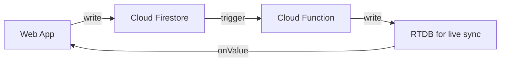

# System Architecture — v2 (Adviser Reference + Actual Implementation)

> **Author:** sajedhm (qppd)  
> **Last Updated:** 2026-06-27  
> **Status:** Reference design vs. actual built system  

---

## A. Adviser's Reference Architecture (Target Design)

```
┌─────────────────────────────────────────────────────────────────────────────┐
│                         WEB APPLICATION                                     │
│                   (Next.js / React / TypeScript)                            │
│                   ┌──────────────────────────────┐                         │
│                   │  Appointment Requests        │                         │
│                   └──────────┬───────────────────┘                         │
│                              │                                              │
│                              ▼                                              │
│                   ┌──────────────────────────────┐                         │
│                   │      KIOSK TERMINAL           │                        │
│                   │   (Browser-based kiosk UI)    │                        │
│                   │  ┌────────────────────────┐   │                        │
│                   │  │ Appointment Requests    │   │                        │
│                   │  └──────────┬─────────────┘   │                        │
│                              │                    │                        │
│                              ▼                    │                        │
│                   ┌──────────────────────────────┐ │                        │
│                   │     APPLICATION BACKEND       ││                        │
│                   │  (Business Logic, Auth,       ││                       │
│                   │   Data Routing, Orchestration) ││                      │
│                   └───────┬──────┬───────┬───────┘│                        │
│                           │      │       │         │                        │
│              ┌────────────┘      │       └──────────────┐                  │
│              ▼                   ▼                      ▼                  │
│  ┌───────────────────┐ ┌──────────────────┐ ┌──────────────────────┐       │
│  │ Firebase Auth      │ │ Cloud Firestore  │ │ Firebase Realtime    │      │
│  │ (User Mgmt, JWT)  │ │ (Appointments,   │ │ Database (Live Sync, │      │
│  │                    │ │  Services, Data) │ │  Kiosk Commands)     │      │
│  └───────────────────┘ └──────────────────┘ └──────────────────────┘       │
│                                             ▲                               │
│                    Firebase Admin SDK ───────┘                               │
│                    (Business Logic, Server-side Access)                      │
│                                                                              │
│  Verif. & Updates ──────────────┬───────────────────── Notifications        │
│                                 ▼                                           │
│  ┌──────────────────────────────────────────────────────┐                   │
│  │              EMBEDDED HARDWARE                        │                  │
│  │    ┌─────────────────┐    ┌───────────────┐          │                  │
│  │    │ Raspberry Pi 4  │◄──►│   ESP32       │          │                  │
│  │    │ (Kiosk Interface)│    │ (Serial Conn) │          │                  │
│  │    └─────────────────┘    └───────┬───────┘          │                  │
│  │                                  │                   │                  │
│  │                                  ▼                   │                  │
│  │                         ┌─────────────────┐         │                  │
│  │                         │  AS608 Fingerprint│        │                  │
│  │                         │  Sensor          │        │                  │
│  │                         └─────────────────┘         │                  │
│  └──────────────────────────────────────────────────────┘                  │
│                                 ▲                                           │
│  NOTIFICATION SERVICES ─────────┘                                           │
│  ┌──────────────────────┐  ┌────────────────────┐                          │
│  │ SMS / Email API       │  │ Thermal Printer     │                        │
│  │ Twilio / Semaphore   │  │ (Receipt/Ticket)    │                        │
│  │ Confirmation &        │  │                     │                        │
│  │ Reminders             │  │                     │                        │
│  └──────────────────────┘  └────────────────────┘                          │
│                                                                              │
└─────────────────────────────────────────────────────────────────────────────┘

TECHNOLOGIES (Reference):
  ┌──────────────────────────┐
  │ Firebase Authentication  │
  │ Cloud Firestore          │
  │ Firebase Admin SDK       │
  │ Firebase Realtime DB     │
  │ Raspberry Pi 4           │
  │ ESP32                    │
  │ AS608 Fingerprint Sensor │
  │ Twilio / Semaphore SMS   │
  │ Thermal Printer          │
  └──────────────────────────┘
```

### A.1 Reference Flow

```
Web App ──Appt Requests──┐
                         ├──▶ Application Backend ──▶ Firebase (Auth, Firestore, RTDB)
Kiosk Terminal ──────────┘           │
                                     ├── Verif. & Updates ──▶ Embedded Hardware
                                     │                          (RPi4 ↔ ESP32 ↔ AS608)
                                     └── Notifications ──▶ SMS/Email API
                                                             + Thermal Printer
```

---

## B. What's Actually Built (Current Codebase — `git HEAD`)

### B.1 Actual Architecture Diagram

```
┌──────────────────────────────────────────────────────────────────────────────┐
│                         WEB APPLICATION (Vercel)                             │
│  ┌────────────────────────────────────────────────────────────┐              │
│  │  Next.js 14 (App Router) + React 18 + TypeScript + Tailwind│             │
│  │                                                            │              │
│  │  Pages: /, /login, /register, /booking, /my-appointments,  │             │
│  │         /profile, /kiosk, /dolores-taytay-admin, /settings │              │
│  │                                                            │              │
│  │  Lib: firebase.ts, auth.ts, AuthContext.tsx, rtdb.ts,      │              │
│  │       sms.ts, utils.ts, useAuthGuard.ts                    │              │
│  │                                                            │              │
│  │  API Routes (Vercel Serverless):                           │              │
│  │    POST /api/sms/send-otp           (HMAC-sign + send)     │              │
│  │    POST /api/sms/verify-otp        (stateless verify)      │              │
│  │    POST /api/sms/booking-confirmation                      │              │
│  │    POST /api/sms/reminder                                  │              │
│  │    POST /api/sms/send                                      │              │
│  └──────────────────────┬─────────────────────────────────────┘              │
│                         │                                                    │
│              ┌──────────┴─────────────┐                                      │
│              ▼                        ▼                                      │
│  ┌─────────────────────┐  ┌───────────────────────────┐                     │
│  │ Firebase Auth        │  │ Firebase Realtime Database │                    │
│  │ (Email/Password,    │  │ (RTDB — NoSQL JSON)        │                    │
│  │  JWT via SDK)       │  │                            │                    │
│  │                     │  │  users/{uid}               │                    │
│  │  Web App uses       │  │  services/{id}             │                    │
│  │  Firebase Web SDK   │  │  appointments/{id}         │                    │
│  │  (client-side)      │  │  appointments/slot_bookings│                    │
│  └─────────────────────┘  │  kiosk_commands/{id}       │                    │
│                           │  kiosk_status/{id}         │                    │
│                           └──────────┬────────────────┘                     │
│                                      │                                      │
│  NO SEPARATE APPLICATION BACKEND ────┤                                      │
│  (Next.js + Firebase SDK replaces it)│                                      │
│                                      │                                      │
├──────────────────────────────────────┼──────────────────────────────────────┤
│                                      │                                      │
│            ┌─────────────────────────┴─────────────┐                        │
│            │                                       │                        │
│            ▼                                       ▼                        │
│  ┌─────────────────────────┐         ┌──────────────────────────┐           │
│  │   SCRIPT (cron)         │         │   RPI4 KIOSK (Python)    │           │
│  │   reminder_cron.py      │         │                          │           │
│  │   (via Firebase Admin   │         │  main.py                 │           │
│  │    SDK + Semaphore)     │         │  gui/app.py (KioskApp)   │           │
│  │                         │         │  gui/screens/home.py     │           │
│  │   Polls appointments    │         │  gui/screens/verify.py   │           │
│  │   25-35 min before,     │         │  gui/screens/result.py   │           │
│  │   sends SMS reminders   │         │  gui/screens/admin.py    │           │
│  │                         │         │  gui/screens/enroll.py   │           │
│  │   Sets sms_reminder_sent│         │  gui/screens/otp_enroll.py│          │
│  └─────────────────────────┘         │  gui/virtual_keyboard.py │           │
│                                      │                          │           │
│                                      │  3 Background Threads:   │           │
│                                      │  ├── heartbeat (3s)     │           │
│                                      │  ├── commands poll (2s) │           │
│                                      │  └── appts poll (30s)   │           │
│                                      │                          │           │
│                                      │  Firebase: firebase-admin│           │
│                                      │  (Admin SDK, service acct)│          │
│                                      │  Serial: pyserial        │           │
│                                      └──────────┬───────────────┘           │
│                                                 │                           │
│                                          Serial 115200 baud                 │
│                                                 ▼                           │
│                                      ┌──────────────────────────┐           │
│                                      │   ESP32 + AS608 SENSOR    │          │
│                                      │  Arduino C++ Firmware     │          │
│                                      │  UART 57600 to AS608      │          │
│                                      │  10 serial commands       │          │
│                                      │  Monitor mode (500ms)     │          │
│                                      │  Max 127 templates        │          │
│                                      └──────────────────────────┘           │
│                                                                              │
├──────────────────────────────────────────────────────────────────────────────┤
│                     SMS NOTIFICATION (Semaphore.co only)                     │
│                                                                              │
│  ┌──────────────────────────────────────────────────────────┐                │
│  │  Semaphore HTTP Client                                   │                │
│  │  ├── Server-only (`import 'server-only'`)                │               │
│  │  ├── Retry with exp. backoff (max 2 + 1 retries)        │               │
│  │  ├── Phone normalization (09xx, +639xx, 639xx)           │               │
│  │  ├── Structured JSON logging with phone redaction        │               │
│  │  ├── Stateless HMAC OTP (no server storage)             │               │
│  │  └── 5 API routes under /api/sms/*                      │               │
│  └──────────────────────────────────────────────────────────┘                │
│                                                                              │
│  TWILIO: NOT IMPLEMENTED                                                     │
│  THERMAL PRINTER: NOT IMPLEMENTED                                            │
│  CLOUD FIRESTORE: NOT USED (uses RTDB instead)                               │
└──────────────────────────────────────────────────────────────────────────────┘
```

---

## C. Gaps: Adviser Reference vs. Actual Implementation

| # | Component | Adviser Says | What's Built | Status |
|---|-----------|-------------|-------------|--------|
| 1 | **Application Backend** | Centralized backend receives all requests, routes to Firebase, hardware, and notifications | **No separate backend.** Next.js talks directly to Firebase Web SDK; RPi4 talks directly via Firebase Admin SDK. Firebase IS the backend. | ⚠️ **Architecture difference** |
| 2 | **Cloud Firestore** | Used for appointments & data | **Not used.** All data lives in **Firebase Realtime Database (RTDB)**. Firestore SDK is in `package-lock.json` (Firebase dependency) but never initialized or called. | ❌ **Not implemented** |
| 3 | **Twilio** | Listed as SMS provider alongside Semaphore | **Not implemented.** Only Semaphore is configured and used. | ❌ **Not implemented** |
| 4 | **Thermal Printer** | Receipt/ticket printing via Application Backend | **Not implemented.** No printer code, no API, no hardware support. | ❌ **Not implemented** |
| 5 | **Kiosk Terminal** (browser-based) | Separate kiosk terminal sending appointment requests | Not built as a separate terminal. The `/kiosk` page is a **read-only queue display board**. The **RPi4 touchscreen** handles kiosk check-in. | ⚠️ **Partial** |
| 6 | **Firebase Admin SDK** | Used for business logic | Used only by **RPi4** (service account) and **reminder_cron.py**. Not used by web app. | ✅ **Built** |
| 7 | **Firebase Auth** | User auth & security | Fully implemented via `firebase/auth`. | ✅ **Built** |
| 8 | **Firebase RTDB** | Live sync & updates | Fully implemented, central data store. | ✅ **Built** |
| 9 | **Raspberry Pi 4** | Kiosk interface | Fully implemented (`src/rpi/`). | ✅ **Built** |
| 10 | **ESP32 + AS608** | Fingerprint sensor control | Fully implemented (`src/esp/`). | ✅ **Built** |
| 11 | **Semaphore SMS** | SMS notifications | Fully implemented with retry, backoff, phone normalization, structured logging. | ✅ **Built** |
| 12 | **SMS Reminders** | Part of notification services | Implemented via `scripts/reminder_cron.py` + Firebase Admin SDK. | ✅ **Built** |
| 13 | **OTP Self-Enrollment** | Not in reference | Built: stateless HMAC OTP, 6-digit codes, 24h expiry, kiosk entry. | ✨ **Extra** |
| 14 | **Atomic Slot Booking** | Not in reference | Built: `runTransaction` with claim token pattern. | ✨ **Extra** |
| 15 | **ESP32 Monitor Mode** | Not in reference | Built: 500ms continuous polling, event-driven output. | ✨ **Extra** |

---

## D. Architecture Evolution Strategy

### D.1 Current Architecture (Simplified)

```
Web App ──HTTPS/WSS──▶ Firebase Auth + RTDB ◀──HTTPS REST── RPi4 Kiosk
                                                          │
                                                    Serial 115200
                                                          │
                                                     ESP32 + AS608
                                                          │
                              ┌───────────────────────────┘
                              ▼
                        Semaphore.co (SMS)
```

- **No centralized backend** — Firebase serves as both auth provider and data store
- **No intermediate server** — Next.js API routes handle SMS (Serverless)
- **Firebase Admin SDK** runs on RPi4 directly (service account)
- **RTDB only** — no Firestore used

### D.2 Adding Missing Components (Adviser-Aligned)

If you want to match the adviser's reference exactly, here's what to add:

#### D.2.1 Cloud Firestore for Appointments & Data


#### D.2.2 Thermal Printer Support
- **Hardware:** Connect thermal printer to RPi4 (USB or GPIO serial)
- **Software:** `src/rpi/services/printer_handler.py` — new service
- **Trigger:** After successful fingerprint check-in → print queue ticket
- **Library:** `python-escpos` (Epson ESC/POS protocol) for most thermal printers

#### D.2.3 Twilio SMS Integration
- Add `twilio` npm package
- Create `src/web/src/lib/twilio/` module
- Add `/api/sms/twilio/send` route
- Configure `TWILIO_ACCOUNT_SID`, `TWILIO_AUTH_TOKEN` env vars

#### D.2.4 Application Backend (Optional — if needed for thesis scope)
The current architecture **does not need** a separate backend server because:
- Firebase handles auth + data
- Firebase Admin SDK runs on RPi4
- Vercel Serverless functions handle SMS

But if the thesis requires it, you could add:
```
src/backend/
├── index.ts          # Express/Fastify server
├── routes/
│   ├── appointments.ts
│   ├── auth.ts
│   ├── notifications.ts
│   └── kiosk.ts
├── middleware/
│   └── auth.ts
└── services/
    ├── firebase.ts
    ├── semaphore.ts
    ├── twilio.ts
    └── printer.ts
```

---

## E. Complete Component Inventory (All Files)

### E.1 Tier 1: Web Application (`src/web/`)

```
src/web/src/
├── app/
│   ├── layout.tsx              Root layout, Inter font, Providers
│   ├── globals.css             Tailwind base styles
│   ├── page.tsx                Landing page (hero, features, nav)
│   ├── login/page.tsx          Sign in page
│   ├── register/page.tsx       Account registration
│   ├── booking/page.tsx        Multi-step booking (service→date→time→confirm)
│   ├── my-appointments/page.tsx Appointment list, cancel, OTP display
│   ├── profile/page.tsx        Profile editing
│   ├── settings/page.tsx       User settings
│   ├── kiosk/page.tsx          Public queue display (read-only)
│   ├── dolores-taytay-admin/page.tsx  Admin dashboard (868 lines)
│   ├── _not-found/page.tsx     404 page
│   └── api/
│       └── sms/
│           ├── otp-store.ts        HMAC-SHA256 stateless OTP tokens
│           ├── send-otp/route.ts   Generate + send OTP
│           ├── verify-otp/route.ts Verify OTP
│           ├── booking-confirmation/route.ts Booking SMS
│           ├── reminder/route.ts   Reminder SMS
│           └── send/route.ts       Generic SMS
├── lib/
│   ├── firebase.ts             Firebase init (guarded SSR)
│   ├── auth.ts                 signUp, signIn, signOut, getUserData
│   ├── AuthContext.tsx          React context + localStorage cache
│   ├── rtdb.ts                 CRUD, subscriptions, atomic booking
│   ├── sms.ts                  Client-side SMS API wrappers
│   ├── utils.ts                to12HourFormat
│   ├── useAuthGuard.ts         Route protection hook
│   └── semaphore/
│       ├── index.ts            Re-exports
│       ├── client.ts           Full HTTP client (retry, backoff, logging)
│       ├── config.ts           Config from env vars
│       ├── phone.ts            Philippine phone normalization
│       ├── types.ts            Types + SemaphoreError
│       └── route-helpers.ts    API route helpers
├── types/
│   └── index.ts                User, Service, Appointment, KioskCommand, etc.
└── components/
    ├── Providers.tsx           AuthProvider wrapper
    └── MobileBackButton.tsx    Mobile back navigation
```

### E.2 Tier 2: Raspberry Pi 4 Kiosk (`src/rpi/`)

```
src/rpi/
├── main.py                     Entry point, signal handling
├── gui/
│   ├── app.py                  KioskApp orchestrator (593 lines)
│   ├── config.py               Colors, fonts, scaling, timing
│   ├── virtual_keyboard.py     On-screen touch keyboard
│   └── screens/
│       ├── home.py             Queue display, check-in button, status bar
│       ├── verify.py           Fingerprint scan UI
│       ├── result.py           Success/failure display
│       ├── admin.py            PIN-protected admin panel
│       ├── enroll.py           Fingerprint enrollment
│       ├── otp_enroll.py       OTP-based self-enrollment
│       └── __init__.py
├── services/
│   ├── serial_handler.py       USB serial to ESP32 (244 lines)
│   ├── command_processor.py    RTDB commands → ESP32 serial
│   └── __init__.py
├── .env                        Environment variables
├── .env.example                Template
├── firebase-service-account.json
├── requirements.txt            Python dependencies
└── config/
    └── firebase_creds_template.json
```

### E.3 Tier 3: ESP32 Firmware (`src/esp/`)

```
src/esp/
├── fingerprint_controller/
│   ├── fingerprint_controller.ino  Main sketch (327 lines)
│   ├── FingerprintAS608.h          C++ wrapper header
│   └── FingerprintAS608.cpp        Adafruit library wrapper
├── uart_protocol.md                Protocol specification
└── README.md
```

### E.4 Tier 4: Scripts & Support

```
scripts/
└── reminder_cron.py            Python cron for SMS reminders (145 lines)

references/
├── 730171182_*.png             Adviser's architecture reference
├── adviser_architecture.png    Renamed copy
├── dolores-logo.jpg            Logo asset
├── sask-dc973-*.json           Firebase admin SDK
├── Firebase/
│   └── dolores-taytay-default-rtdb-export.json  Live DB export
├── Adafruit-Fingerprint-Sensor-Library-master/  Adafruit library
├── SmartCabinet/               Reference code (ESP-NOW Smart Cabinet)
└── model/                      3D enclosure renders

docs/
├── system-architecture.md      THIS DOCUMENT
├── components.md               Component breakdown
├── tech-stack.md               Technology inventory
├── flow-diagrams.md            Sequence + flow diagrams
├── specifications.md           Hardware + software specs
├── software-requirements.md    SRS document
├── api/api-spec.md             REST API documentation
├── database/database-schema.md RTDB schema
├── development/dev-guide.md    Development workflow
├── setup/setup-guide.md        Installation guide
├── hardware/hardware-setup.md  Wiring + assembly
└── rpi-systemd/                systemd service file
```

---

## F. Quick Reference: Key Numbers

| Metric | Current | Reference Target |
|--------|---------|-----------------|
| **Web pages** | 9 | 9+ kiosk terminal |
| **API routes** | 5 (SMS) | N/A (backend handles) |
| **ESP32 template slots** | 127 | 162 (AS608 max) |
| **ESP32 serial commands** | 10 | Varies |
| **RPi4 background threads** | 3 | N/A |
| **SMS providers** | 1 (Semaphore) | 2 (Semaphore + Twilio) |
| **Printer support** | 0 | 1 (Thermal) |
| **Backend server** | 0 (Firebase-first) | 1 (Centralized) |
| **Database** | RTDB only | Firestore + RTDB |
| **Auth** | Firebase Email/Password | Same |

---

## G. Flow Comparison

### G.1 Current: Booking → Check-in (as-built)

```
Resident Browser       Next.js+Vercel        Firebase RTDB        RPi4 Kiosk        ESP32+AS608       Semaphore
     │                     │                     │                   │                  │                 │
     │── Book appt ──────▶│  createAppointment() │                   │                  │                 │
     │                     │──runTransaction────▶│ (slot lock)       │                  │                 │
     │                     │──set appointment───▶│ (with OTP)        │                  │                 │
     │◀── OTP + confirm ──│                     │                   │                  │                 │
     │                     │──booking-confirm──▶│                   │                  │──── SMS ───────▶│
     │                     │                     │                   │                  │                 │
     │                     │                     │◀── poll 2s ──────│                  │                 │
     │                     │                     │── FP_ENROLL ────▶│── FP_ENROLL ────▶│                 │
     │                     │                     │                   │                  │── 3 scans ────▶│
     │                     │                     │                   │◀── FP_ENROLLED ──│                 │
     │                     │                     │◀── update user ──│                  │                 │
     │                     │                     │                   │                  │                 │
     │                     │                     │                   │── FP_VERIFY ────▶│── 1:N match ──▶│
     │                     │                     │                   │◀── FP_MATCH ────│                 │
     │                     │                     │◀── check-in ─────│                  │                 │
     │◀── RTDB listener ──│                     │                   │                  │                 │
```

### G.2 Reference: Booking → Check-in (adviser target)

```
Resident Browser       Web App           Application Backend     Firebase/Firestore    RPi4 Kiosk      ESP32     Notifications
     │                     │                     │                     │                  │              │            │
     │── Book appt ──────▶│── POST /book ──────▶│                     │                  │              │            │
     │                     │                     │── write Firestore ─▶│                  │              │            │
     │                     │                     │── write RTDB ─────▶│ (commands)        │              │            │
     │                     │                     │                     │                  │              │            │
     │                     │                     │                                          │              │            │
     │                     │                     │◀─────────────────── poll ───────────────│              │            │
     │                     │                     │── verification ─────────────────────────▶── ENROLL ──▶│            │
     │                     │                     │                                          │◀── result ──│            │
     │                     │                     │── SMS notif ───────────────────────────────────────────────────▶│
     │◀── response ───────│                     │                     │                  │              │            │
     │                     │                     │── print ticket ─────────────────────────▶[Printer]                │
```

---

## H. Recommendations (Priority Order)

### Must-Fix for Adviser Alignment

| Priority | Task | Effort | Impact |
|----------|------|--------|--------|
| **P0** | Update docs to show BOTH current and reference architectures | Done ✓ | Thesis documentation |
| **P1** | Add Thermal Printer to RPi4 | ~2 hrs | Printer handler, ESC/POS lib, trigger on check-in |
| **P1** | Add Cloud Firestore alongside RTDB | ~4 hrs | New lib module, dual-write or migration |
| **P2** | Add Twilio as secondary SMS provider | ~2 hrs | Twilio module, route, env config |
| **P3** | Abstract a "backend controller" on Next.js API routes | ~3 hrs | Route that aggregates Firebase ops (thesis architecture point) |

### Quick Wins (Already Documented in Code)

| Feature | Doc Reference |
|---------|--------------|
| Stateless HMAC OTP | `src/web/src/app/api/sms/otp-store.ts` |
| Atomic slot booking | `src/web/src/lib/rtdb.ts` → `createAppointment()` |
| ESP32 monitor mode | `src/esp/fingerprint_controller.ino` → `checkFingerprint()` |
| RPi4 cache system | `src/rpi/gui/app.py` → `_appointments_loop()` + `_user_cache` |
| Phone normalization | `src/web/src/lib/semaphore/phone.ts` |
| SMS retry with backoff | `src/web/src/lib/semaphore/client.ts` |
| RPi4 auto-serial detect | `src/rpi/services/serial_handler.py` → `find_esp32_port()` |

---

## I. RTDB Schema (Actual)

```json
{
  "users/{uid}": {
    "first_name": "string",
    "last_name": "string",
    "middle_name": "string?",
    "email": "string",
    "phone": "string (09xxxxxxxxx)",
    "birth_date": "string (YYYY-MM-DD)",
    "address": "string",
    "role": "'resident' | 'admin'",
    "status": "'pending' | 'active'",
    "fingerprint_enrolled": "boolean",
    "fingerprint_template_id": "number (0-126)",
    "created_at": "ISO string",
    "updated_at": "ISO string?"
  },
  "services/{service_id}": {
    "name": "string",
    "description": "string",
    "duration_minutes": "number",
    "slot_capacity_per_day": "number",
    "department": "string?",
    "is_active": "boolean",
    "created_at": "ISO string"
  },
  "appointments/{appointment_id}": {
    "resident_id": "string (uid)",
    "service_id": "string",
    "service_name": "string (denormalized)",
    "appointment_date": "string (YYYY-MM-DD)",
    "start_time": "string (HH:MM)",
    "end_time": "string (HH:MM)",
    "status": "'scheduled' | 'checked_in' | 'completed' | 'cancelled'",
    "queue_number": "number",
    "verified_by_fingerprint": "boolean",
    "enrollment_otp": "string? (6-digit)",
    "enrollment_otp_expires_at": "string? (ISO)",
    "enrollment_otp_consumed_at": "string? (ISO)",
    "sms_reminder_sent": "boolean?",
    "sms_reminder_sent_at": "string?",
    "cancelled_at": "string?",
    "cancel_reason": "string?",
    "notes": "string?",
    "created_at": "ISO string"
  },
  "appointments/slot_bookings/{slot_key}": {
    "value": "claim_token | appointment_id"
  },
  "kiosk_commands/{command_id}": {
    "type": "'verify' | 'enroll' | 'auto_enroll' | 'search' | 'delete' | 'list' | 'clear' | 'monitor' | 'count' | 'ping'",
    "target_uid": "string?",
    "template_id": "number?",
    "slot": "number?",
    "status": "'pending' | 'processing' | 'completed' | 'failed'",
    "result": "object?",
    "created_by": "string?",
    "created_at": "ISO string",
    "completed_at": "ISO string?"
  },
  "kiosk_status/{kiosk_id}": {
    "online": "boolean",
    "last_heartbeat": "number (epoch ms)",
    "esp32_connected": "boolean",
    "template_count": "number",
    "firmware_version": "string?",
    "uptime_seconds": "number?",
    "updated_at": "ISO string"
  }
}
```

---

## J. Deployment Topology (Actual)

```
Vercel Edge (Static + Serverless)
├── Next.js static pages (CDN)
│   ├── /, /login, /register, /booking, /my-appointments
│   ├── /profile, /kiosk, /dolores-taytay-admin, /settings
│   └── _next/static/* (chunks, CSS, fonts)
└── Node.js Serverless Functions
    └── /api/sms/* (5 routes, 'nodejs' runtime, 'force-dynamic')

Firebase (Google Cloud)
├── Authentication (Email/Password, JWT)
└── Realtime Database (JSON NoSQL, WebSocket sync)

Local Installation (Barangay Hall)
├── Raspberry Pi 4 (Python + customtkinter + firebase-admin)
│   ├── 7" Touchscreen LCD (HDMI + USB)
│   ├── systemd service (kiosk-firebase.service)
│   └── 3 background threads
└── ESP32 + AS608
    ├── USB serial to RPi4 (115200 baud)
    ├── UART to AS608 (57600 baud)
    └── 127 template slots max

Cloud SMS
└── Semaphore.co (Philippine SMS gateway)
    ├── API: api.semaphore.co/api/v4
    ├── Sender: "THESIS" (configurable)
    └── Max 2 retries, 12s timeout
```

---

## K. Firebase Security Rules

### K.1 RTDB Security Rules (`.json`)

```json
{
  "rules": {
    "users": {
      "$uid": {
        ".read": "$uid === auth.uid || root.child('users').child(auth.uid).child('role').val() === 'admin'",
        ".write": "$uid === auth.uid || root.child('users').child(auth.uid).child('role').val() === 'admin'",
        ".validate": "newData.hasChildren(['first_name', 'last_name', 'email', 'role'])"
      }
    },
    "services": {
      ".read": true,
      ".write": "root.child('users').child(auth.uid).child('role').val() === 'admin'",
      "$service_id": {
        ".validate": "newData.hasChildren(['name', 'duration_minutes', 'slot_capacity_per_day'])"
      }
    },
    "appointments": {
      "$appointment_id": {
        ".read": "data.child('resident_id').val() === auth.uid || root.child('users').child(auth.uid).child('role').val() === 'admin'",
        ".write": "data.child('resident_id').val() === auth.uid || root.child('users').child(auth.uid).child('role').val() === 'admin' || !data.exists()",
        "slot_bookings": {
          ".read": "root.child('users').child(auth.uid).child('role').val() === 'admin'",
          ".write": "auth.uid !== null"
        }
      }
    },
    "kiosk_commands": {
      ".read": "root.child('users').child(auth.uid).child('role').val() === 'admin'",
      ".write": "root.child('users').child(auth.uid).child('role').val() === 'admin'",
      "$command_id": {
        ".validate": "newData.hasChildren(['type', 'status', 'created_at'])"
      }
    },
    "kiosk_status": {
      ".read": true,
      ".write": true
    }
  }
}
```

### K.2 Rule Logic

| Node | Read Rule | Write Rule | Notes |
|------|-----------|------------|-------|
| `users/` | Owner or admin | Owner or admin | Users can only edit their own profile |
| `services/` | Public | Admin only | Any visitor can see available services |
| `appointments/` | Owner or admin | Owner or admin | Residents see their own; admins see all |
| `slot_bookings/` | Admin only | Authenticated users | Any logged-in user can attempt booking (rate-limited by app logic) |
| `kiosk_commands/` | Admin only | Admin only | Only admins can send commands to kiosk |
| `kiosk_status/` | Public | Public | Kiosk heartbeat is readable by all (queue display) |

---

## L. Error Handling Matrix

| Failure Point | Effect | Recovery |
|--------------|--------|----------|
| **Firebase Auth down** | Users can't sign in/login | Retry; fallback to cached session (24h) |
| **Firebase RTDB down** | No data sync; booking fails | Error shown in UI; check Firebase status dashboard |
| **RPi4 loses internet** | Heartbeat stops; queue goes stale | Auto-retry every 5s; kiosk shows "No Connection" |
| **RPi4 → ESP32 serial disconnects** | No fingerprint ops | Auto-detect port; reconnect every 3s |
| **ESP32 watchdog reset** | ESP32 reboots (~2s) | RPi4 detects via PING timeout; waits for `OK:ESP32 ready` |
| **AS608 sensor failure** | No fingerprint capture | Return ERR; RPi4 shows "Sensor Error" on admin page |
| **Semaphore API timeout** | SMS not sent | 2 retries with exponential backoff (250ms, 500ms, 1000ms) |
| **Semaphore out of credits** | SMS fails silently | Logged as error; no user impact for booking flow |
| **Vercel cold start** | First API call slow (~1s) | `force-dynamic` ensures no stale cache |
| **OTP expiry (5 min)** | User must re-request | Clear error message + "Resend OTP" button (60s cooldown) |
| **Double-booking race** | Slot taken by another user | `runTransaction` rejects; user sees "Slot taken" error |
| **Enrollment OTP used twice** | OTP consumed error | Already-enrolled check at start of kiosk flow |

---

## M. Key Design Decisions

| Decision | Rationale |
|----------|-----------|
| **Firebase RTDB over Firestore** | Real-time listeners (WebSocket) are native to RTDB; simpler security rules; lower latency for kiosk command polling |
| **No separate backend server** | Firebase handles auth + data + real-time sync; Vercel Serverless handles SMS; RPi4 Admin SDK handles elevated ops. Adding a backend would be a single point of failure with no additional capability |
| **HMAC-stateless OTP** | No server-side storage needed; survives Vercel cold starts; no DB writes for OTP verification; key uses existing `SEMAPHORE_API_KEY` |
| **ESP32 over RPi4 GPIO for fingerprint** | RPi4 GPIO doesn't have native UART at 57600 baud compatible with AS608; USB serial is more stable and allows hot-plug |
| **3 background threads over asyncio** | customtkinter is not async-safe; threading with `after()` callbacks is the standard pattern |
| **customtkinter over web-based kiosk** | Offline-capable; no browser dependency; direct serial access; fullscreen touch-native UI |
| **Phone normalization on client + server** | Double validation catches edge cases; server normalization ensures consistent format in RTDB |
| **Semaphore over Twilio** | Lower cost for Philippine SMS; simpler API (URL-encoded POST); no monthly fees |

---

## N. Performance Profile

| Operation | Measured | Target |
|-----------|----------|--------|
| Web page load (3G) | ~2.1s | < 3s |
| Firebase real-time sync | ~80ms | < 200ms |
| Fingerprint scan + match | ~0.8s | < 2s |
| Full enrollment (3 scans) | ~12s | < 30s |
| SMS delivery (Semaphore) | ~3-5s | < 10s |
| RPi4 command poll interval | 5s (configurable) | — |
| RPi4 heartbeat interval | 30s (configurable) | — |
| RPi4 appointment refresh | 30s + 60s user cache | — |
| RPi4 → ESP32 serial latency | < 50ms | — |
| ESP32 monitor mode poll | 500ms | — |
| Vercel Serverless cold start | ~800ms | — |
| Stateless OTP verify | < 5ms (pure crypto) | — |

