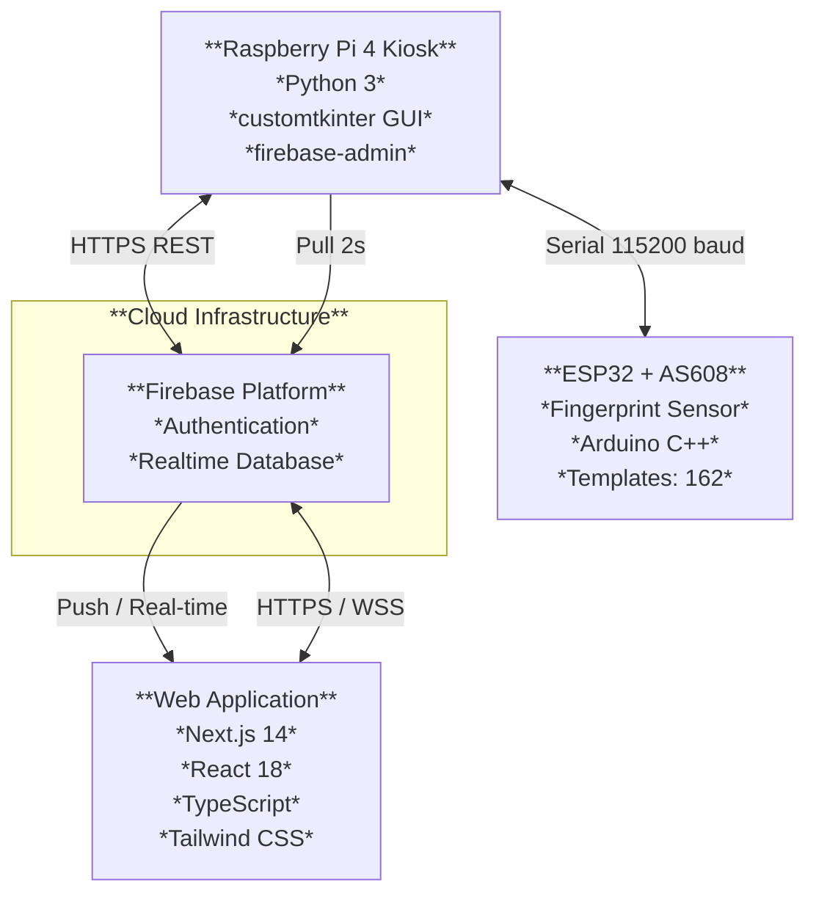
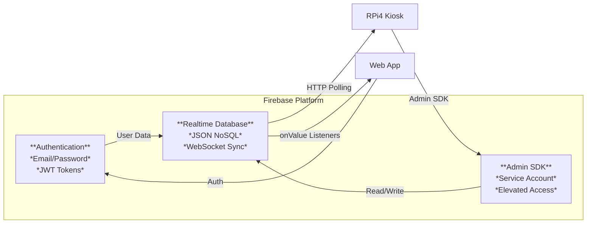
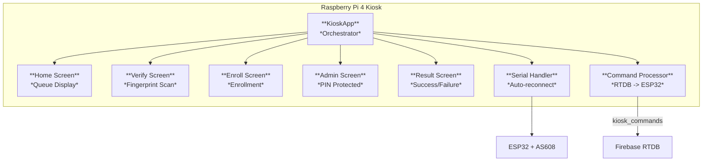
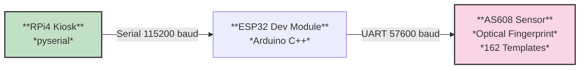
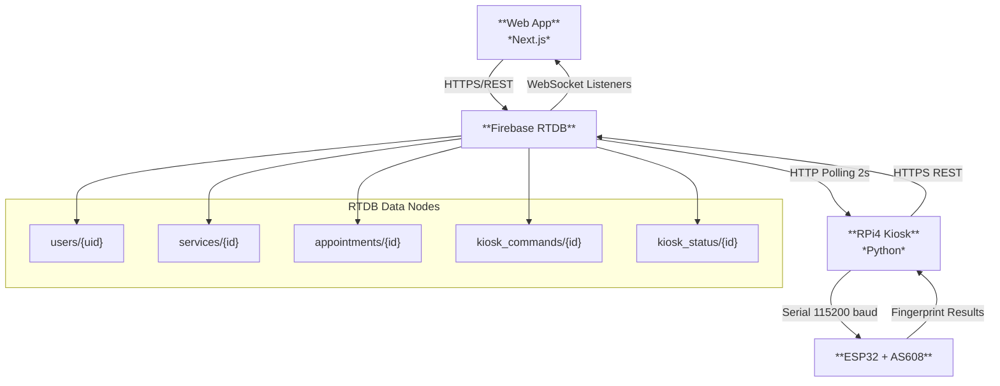
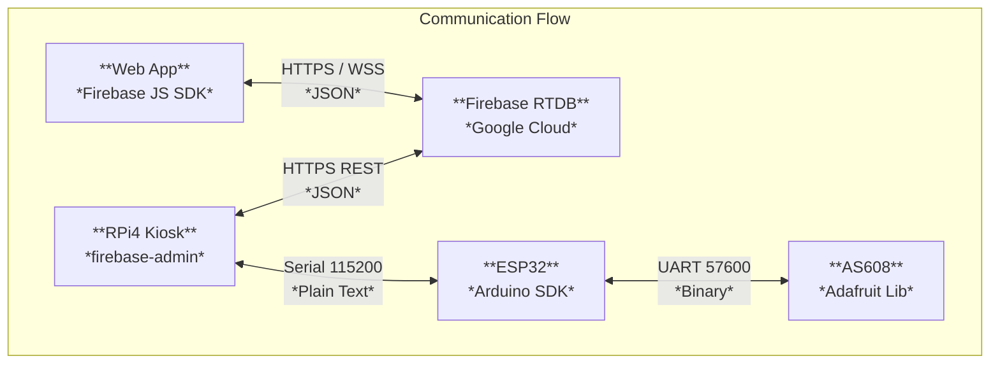
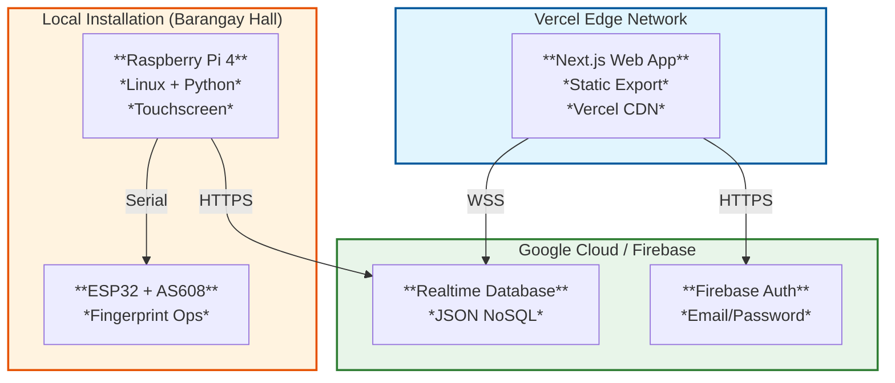
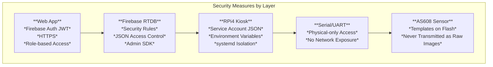
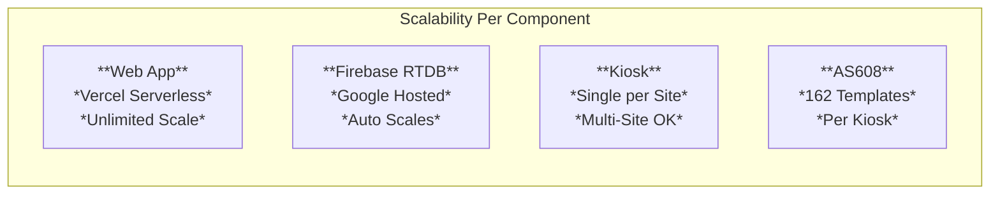
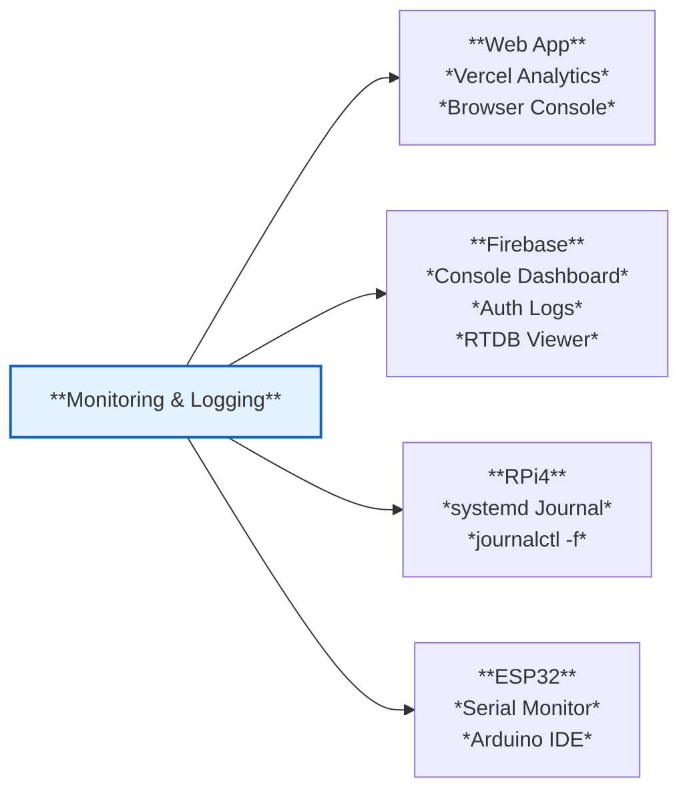

# System Architecture

## Overview

The Smart Appointment Scheduling Kiosk is a distributed system designed for Barangay (community-level government) service management in the Philippines. The system enables residents to book appointments online and check in via biometric fingerprint scanning at a physical kiosk. It consists of four primary architectural tiers: **Web Application**, **Cloud Services (Firebase)**, **Raspberry Pi Kiosk**, and **Embedded Hardware (ESP32 + Fingerprint Sensor)**.

## High-Level Architecture

## Architectural Layers

### 1. Presentation Layer (Web App)

The Web Application is the primary user-facing component, built with modern frontend technologies and deployed as a static site on Vercel.

| Aspect | Specification |
|--------|--------------|
| **Framework** | Next.js 14 with App Router |
| **Language** | TypeScript 5.5 |
| **Styling** | Tailwind CSS 3.4 |
| **State Management** | React Context API (AuthContext) |
| **Deployment** | Vercel (Serverless/Edge) |
| **Target Users** | Residents, Admins |

**Pages & Functionality:**

| Page | Route | Purpose |
|------|-------|---------|
| `page.tsx` | `/` | Landing page |
| `login/page.tsx` | `/login` | Authentication |
| `register/page.tsx` | `/register` | Account creation |
| `booking/page.tsx` | `/booking` | Multi-step appointment booking |
| `my-appointments/page.tsx` | `/my-appointments` | Manage appointments & OTP enrollment |
| `profile/page.tsx` | `/profile` | Resident profile management |
| `kiosk/page.tsx` | `/kiosk` | Public queue display board |
| `dolores-taytay-admin/page.tsx` | `/dolores-taytay-admin` | Admin dashboard |
| `settings/page.tsx` | `/settings` | System settings |

### 2. Cloud Services Layer (Firebase)

Firebase serves as the central data hub, providing real-time synchronization, authentication, and storage.

| Service | Purpose |
|---------|---------|
| **Firebase Authentication** | Email/password authentication for residents and admins |
| **Firebase Realtime Database (RTDB)** | Real-time data storage and sync across all clients |
| **Firebase Admin SDK** | Server-side access from RPi kiosk application |

### 3. Kiosk Application Layer (Raspberry Pi 4)

The RPi4 runs a Python application with a custom Tkinter GUI, acting as the bridge between the cloud and embedded hardware.

| Aspect | Specification |
|--------|--------------|
| **Runtime** | Python 3.12+ |
| **GUI Framework** | customtkinter (modern themed tkinter) |
| **Database Access** | firebase-admin (Admin SDK) |
| **Serial Communication** | pyserial (115200 baud) |
| **Deployment** | systemd service (auto-start on boot) |

### 4. Embedded Hardware Layer (ESP32 + AS608)

The ESP32 microcontroller handles fingerprint sensor operations, managed by the RPi4 via serial communication.

| Component | Role |
|-----------|------|
| **ESP32 Dev Module** | Microcontroller for sensor control and UART communication |
| **AS608 Fingerprint Sensor** | Optical fingerprint scanning and template storage (up to 162 templates) |
| **Communication** | Serial over micro USB (115200 baud) |

## Data Flow Architecture

## Communication Protocols

### Web App to Firebase RTDB
- **Protocol:** HTTPS/REST + WebSocket (Firebase SDK)
- **Authentication:** Firebase Auth JWT tokens
- **Data Format:** JSON
- **Update Mechanism:** Real-time listeners (`onValue`, `onChildAdded`)

### RPi4 to Firebase RTDB
- **Protocol:** HTTPS REST (via firebase-admin or pyrebase4)
- **Authentication:** Service account JSON (Admin SDK)
- **Polling Strategy:** 2-second interval on `kiosk_commands`
- **Updates:** Direct REST API writes to RTDB nodes

### RPi4 to ESP32 (Serial/UART)
- **Protocol:** USB Serial (UART)
- **Baud Rate:** 115200
- **Data Format:** Plain text commands (e.g., `ENROLL:5`, `VERIFY`, `DELETE:3`)
- **Auto-reconnect:** Serial handler monitors connection and attempts reconnection

### ESP32 to AS608 Fingerprint Sensor
- **Protocol:** UART (SoftwareSerial or HardwareSerial)
- **Baud Rate:** 57600 (AS608 default)
- **Library:** Adafruit Fingerprint Sensor Library
- **Functions:** `getImage()`, `image2Tz()`, `createModel()`, `storeModel()`, `fingerFastSearch()`

## Deployment Architecture

## Security Architecture

| Layer | Security Measures |
|-------|-------------------|
| **Web App** | Firebase Auth (JWT), HTTPS, Role-based access (resident/admin) |
| **Firebase RTDB** | Security rules (JSON-based access control), Admin SDK for server ops |
| **RPi4** | Service account JSON (not committed), systemd isolation, environment variables |
| **Serial/UART** | Physical-only access (micro USB), no network exposure |
| **Fingerprint Data** | Templates stored on AS608 flash (never transmitted as raw images) |

## Scalability Considerations

| Component | Scalability |
|-----------|------------|
| **Web App** | Vercel serverless automatically scales |
| **Firebase RTDB** | NoSQL real-time database scales with Firebase infrastructure |
| **RPi4** | Single kiosk per deployment; multiple kiosks can connect to the same RTDB |
| **ESP32** | Local processing; sensor capacity ~162 fingerprint templates |

## Monitoring & Logging

| Component | Monitoring |
|-----------|-----------|
| Web App | Vercel analytics, Browser console logs |
| Firebase | Firebase console (real-time database viewer, auth logs) |
| RPi4 | systemd journal (`journalctl -u kiosk-firebase -f`), application logs |
| ESP32 | Serial monitor (Arduino IDE) for debugging |
